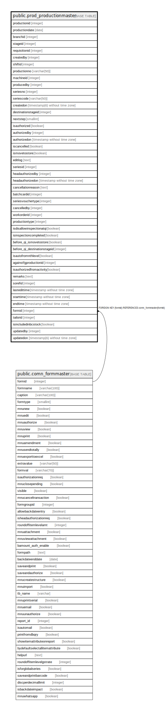

# public.prod_productionmaster

## Description

## Columns

| Name | Type | Default | Nullable | Children | Parents | Comment |
| ---- | ---- | ------- | -------- | -------- | ------- | ------- |
| productionid | integer | nextval('prod_productionmaster_productionid_seq'::regclass) | false |  |  |  |
| productiondate | date |  | true |  |  |  |
| branchid | integer |  | true |  |  |  |
| stageid | integer |  | true |  |  |  |
| requisitionid | integer |  | true |  |  |  |
| createdby | integer |  | true |  |  |  |
| shiftid | integer |  | true |  |  |  |
| productionno | varchar(50) |  | true |  |  |  |
| machineid | integer |  | true |  |  |  |
| producedby | integer |  | true |  |  |  |
| seriesno | integer |  | true |  |  |  |
| seriescode | varchar(50) |  | true |  |  |  |
| createdon | timestamp(6) without time zone | now() | true |  |  |  |
| destinationstageid | integer |  | true |  |  |  |
| nextstep | smallint | 2 | false |  |  |  |
| isauthorized | boolean | false | true |  |  |  |
| authorizedby | integer |  | true |  |  |  |
| authorizedon | timestamp without time zone |  | true |  |  |  |
| iscancelled | boolean | false | false |  |  |  |
| ismovetostore | boolean | false | true |  |  |  |
| editlog | text |  | true |  |  |  |
| seriesid | integer |  | true |  |  |  |
| headauthorizedby | integer |  | true |  |  |  |
| headauthorizedon | timestamp without time zone |  | true |  |  |  |
| cancellationreason | text |  | true |  |  |  |
| batchcardid | integer |  | true |  |  |  |
| seriesvouchertype | integer |  | true |  |  |  |
| cancelledby | integer |  | true |  |  |  |
| workorderid | integer |  | true |  |  | It will be filled when stage id is -1 (Work Order Stage) It is jobworkid of jw_template |
| productiontype | integer | 0 | true |  |  | 0--Production And Movement 1--Production (Trading) 2--Production from Quality Inspection 3--Workorder Movement 4--Rejection |
| isdisallowinspectionatqi | boolean | false | true |  |  | Is By Pass Inspection at Quality Inspection |
| isinspectioncompleted | boolean | false | true |  |  |  |
| before_qi_ismovetostore | boolean |  | true |  |  | Update for New Production From QI for IsMoveToStore=True in Old Production |
| before_qi_destinationstageid | integer |  | true |  |  | Update for New Production From QI for IsMoveToStore=True in Old Production |
| isautofromnthlevel | boolean | false | true |  |  |  |
| againstfgproductionid | integer |  | true |  |  |  |
| isauthorizedfromactivity | boolean | false | false |  |  |  |
| remarks | text |  | true |  |  |  |
| sorefid | integer |  | true |  |  |  |
| lastedittime | timestamp without time zone | now() | false |  |  |  |
| starttime | timestamp without time zone |  | true |  |  |  |
| endtime | timestamp without time zone |  | true |  |  |  |
| formid | integer | 47 | false |  | [public.comn_formmaster](public.comn_formmaster.md) |  |
| tailorid | integer |  | true |  |  |  |
| isincludedinbcstock | boolean |  | true |  |  |  |
| updatedby | integer |  | true |  |  |  |
| updatedon | timestamp(6) without time zone | NULL::timestamp without time zone | true |  |  |  |

## Constraints

| Name | Type | Definition |
| ---- | ---- | ---------- |
| prod_productionmaster_formid_fkey | FOREIGN KEY | FOREIGN KEY (formid) REFERENCES comn_formmaster(formid) |
| prod_productionmaster_pkey | PRIMARY KEY | PRIMARY KEY (productionid) |
| uniqueproductionno | UNIQUE | UNIQUE (productionno, productiondate, branchid, seriesid, seriesvouchertype) |

## Indexes

| Name | Definition |
| ---- | ---------- |
| prod_productionmaster_pkey | CREATE UNIQUE INDEX prod_productionmaster_pkey ON public.prod_productionmaster USING btree (productionid) |
| uniqueproductionno | CREATE UNIQUE INDEX uniqueproductionno ON public.prod_productionmaster USING btree (productionno, productiondate, branchid, seriesid, seriesvouchertype) |
| Index_PrdMast_BatchStockWOBatchCard | CREATE INDEX "Index_PrdMast_BatchStockWOBatchCard" ON public.prod_productionmaster USING btree (productionid, branchid, stageid, productiondate, iscancelled, batchcardid) WHERE ((iscancelled = false) AND (stageid > 0) AND (productionid > 0) AND (COALESCE(batchcardid, 0) = 0)) |
| Index_PrdMast_BatchStockWOBatchCard2 | CREATE INDEX "Index_PrdMast_BatchStockWOBatchCard2" ON public.prod_productionmaster USING btree (ismovetostore, isauthorized, iscancelled, productionid, destinationstageid, stageid, branchid, productiondate) WHERE ((ismovetostore = false) AND (isauthorized = true) AND (iscancelled = false) AND (COALESCE(destinationstageid, stageid) > 0) AND (productionid > 0)) |
| Index_PrdMast_StgStk1 | CREATE INDEX "Index_PrdMast_StgStk1" ON public.prod_productionmaster USING btree (isauthorized, iscancelled, ismovetostore, destinationstageid, stageid, productiondate, productionid, branchid) |
| ui_production_no | CREATE UNIQUE INDEX ui_production_no ON public.prod_productionmaster USING btree (branchid, productiontype, productiondate, productionno, seriesvouchertype) WHERE (productionid > 0) |

## Triggers

| Name | Definition |
| ---- | ---------- |
| tgr_updatecostdate_prdmast | CREATE TRIGGER tgr_updatecostdate_prdmast AFTER INSERT OR UPDATE ON public.prod_productionmaster FOR EACH ROW EXECUTE FUNCTION tgr_updatecostdate() |

## Relations

---

> Generated by [tbls](https://github.com/k1LoW/tbls)
