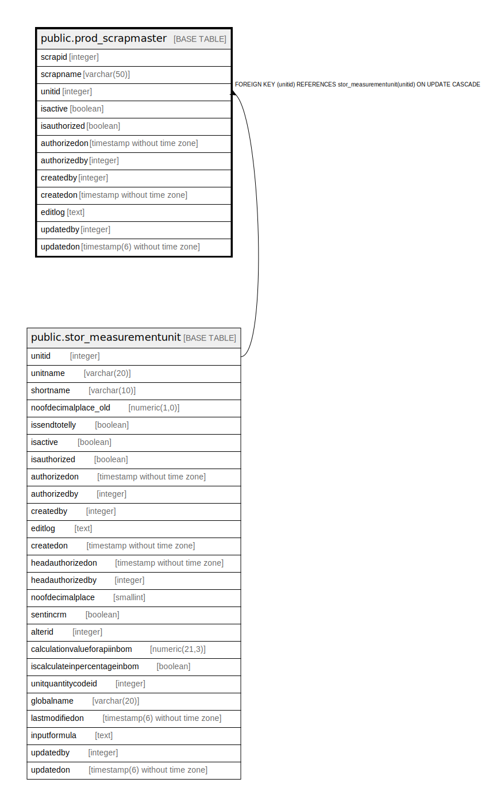

# public.prod_scrapmaster

## Description

## Columns

| Name | Type | Default | Nullable | Children | Parents | Comment |
| ---- | ---- | ------- | -------- | -------- | ------- | ------- |
| scrapid | integer | nextval('prod_scrapmaster_scrapid_seq'::regclass) | false |  |  |  |
| scrapname | varchar(50) |  | true |  |  |  |
| unitid | integer |  | true |  | [public.stor_measurementunit](public.stor_measurementunit.md) |  |
| isactive | boolean | true | false |  |  |  |
| isauthorized | boolean | false | false |  |  |  |
| authorizedon | timestamp without time zone |  | true |  |  |  |
| authorizedby | integer |  | true |  |  |  |
| createdby | integer |  | true |  |  |  |
| createdon | timestamp without time zone | now() | true |  |  |  |
| editlog | text |  | true |  |  |  |
| updatedby | integer |  | true |  |  |  |
| updatedon | timestamp(6) without time zone | NULL::timestamp without time zone | true |  |  |  |

## Constraints

| Name | Type | Definition |
| ---- | ---- | ---------- |
| scrapmaster_fk | FOREIGN KEY | FOREIGN KEY (unitid) REFERENCES stor_measurementunit(unitid) ON UPDATE CASCADE |
| scrapmaster_pkey | PRIMARY KEY | PRIMARY KEY (scrapid) |

## Indexes

| Name | Definition |
| ---- | ---------- |
| scrapmaster_pkey | CREATE UNIQUE INDEX scrapmaster_pkey ON public.prod_scrapmaster USING btree (scrapid) |

## Relations

---

> Generated by [tbls](https://github.com/k1LoW/tbls)
