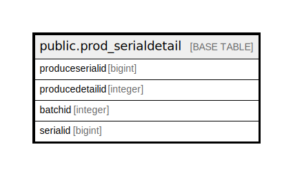

# public.prod_serialdetail

## Description

## Columns

| Name | Type | Default | Nullable | Children | Parents | Comment |
| ---- | ---- | ------- | -------- | -------- | ------- | ------- |
| produceserialid | bigint | nextval('prod_serialdetail_produceserialid_seq'::regclass) | false |  |  |  |
| producedetailid | integer |  | true |  |  |  |
| batchid | integer |  | true |  |  |  |
| serialid | bigint |  | true |  |  |  |

## Constraints

| Name | Type | Definition |
| ---- | ---- | ---------- |
| prod_serialdetail_pkey | PRIMARY KEY | PRIMARY KEY (produceserialid) |

## Indexes

| Name | Definition |
| ---- | ---------- |
| prod_serialdetail_pkey | CREATE UNIQUE INDEX prod_serialdetail_pkey ON public.prod_serialdetail USING btree (produceserialid) |
| Index_PE_SerDet_PEDetID | CREATE INDEX "Index_PE_SerDet_PEDetID" ON public.prod_serialdetail USING btree (producedetailid) |

## Relations

---

> Generated by [tbls](https://github.com/k1LoW/tbls)
