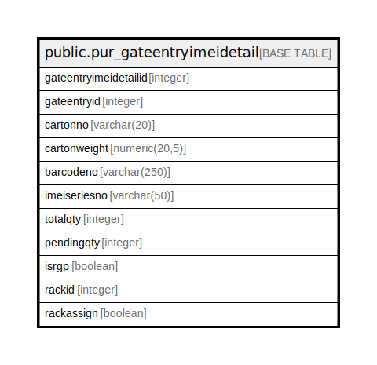

# public.pur_gateentryimeidetail

## Description

Carton Scanning Entry On gate Entry

## Columns

| Name | Type | Default | Nullable | Children | Parents | Comment |
| ---- | ---- | ------- | -------- | -------- | ------- | ------- |
| gateentryimeidetailid | integer | nextval('pur_gateentryimeidetail_gateentryimeidetailid_seq'::regclass) | false |  |  |  |
| gateentryid | integer |  | true |  |  |  |
| cartonno | varchar(20) |  | true |  |  |  |
| cartonweight | numeric(20,5) | 0 | true |  |  |  |
| barcodeno | varchar(250) |  | true |  |  |  |
| imeiseriesno | varchar(50) | ''::character varying | false |  |  |  |
| totalqty | integer | 0 | false |  |  |  |
| pendingqty | integer | 0 | false |  |  |  |
| isrgp | boolean | false | false |  |  |  |
| rackid | integer |  | true |  |  |  |
| rackassign | boolean | false | true |  |  |  |

## Constraints

| Name | Type | Definition |
| ---- | ---- | ---------- |
| pur_gateentryimeidetail_pkey | PRIMARY KEY | PRIMARY KEY (gateentryimeidetailid) |

## Indexes

| Name | Definition |
| ---- | ---------- |
| pur_gateentryimeidetail_pkey | CREATE UNIQUE INDEX pur_gateentryimeidetail_pkey ON public.pur_gateentryimeidetail USING btree (gateentryimeidetailid) |
| Index_GE_IMDet_GEID | CREATE INDEX "Index_GE_IMDet_GEID" ON public.pur_gateentryimeidetail USING btree (gateentryid) |

## Relations

---

> Generated by [tbls](https://github.com/k1LoW/tbls)
