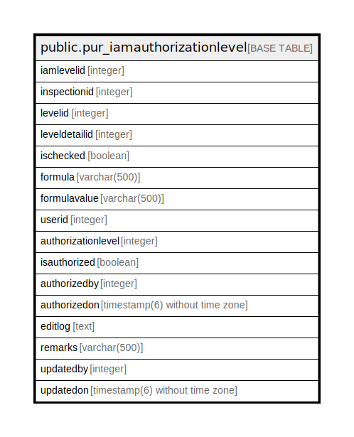

# public.pur_iamauthorizationlevel

## Description

## Columns

| Name | Type | Default | Nullable | Children | Parents | Comment |
| ---- | ---- | ------- | -------- | -------- | ------- | ------- |
| iamlevelid | integer | nextval('pur_iamauthorizationlevel_iamlevelid_seq'::regclass) | false |  |  |  |
| inspectionid | integer |  | true |  |  |  |
| levelid | integer |  | true |  |  |  |
| leveldetailid | integer |  | true |  |  |  |
| ischecked | boolean | false | true |  |  |  |
| formula | varchar(500) |  | true |  |  |  |
| formulavalue | varchar(500) |  | true |  |  |  |
| userid | integer |  | true |  |  |  |
| authorizationlevel | integer |  | true |  |  |  |
| isauthorized | boolean | false | true |  |  |  |
| authorizedby | integer |  | true |  |  |  |
| authorizedon | timestamp(6) without time zone |  | true |  |  |  |
| editlog | text |  | true |  |  |  |
| remarks | varchar(500) |  | true |  |  |  |
| updatedby | integer |  | true |  |  |  |
| updatedon | timestamp(6) without time zone | NULL::timestamp without time zone | true |  |  |  |

## Constraints

| Name | Type | Definition |
| ---- | ---- | ---------- |
| pur_iamauthorizationlevel_pkey | PRIMARY KEY | PRIMARY KEY (iamlevelid) |

## Indexes

| Name | Definition |
| ---- | ---------- |
| pur_iamauthorizationlevel_pkey | CREATE UNIQUE INDEX pur_iamauthorizationlevel_pkey ON public.pur_iamauthorizationlevel USING btree (iamlevelid) |

## Relations

---

> Generated by [tbls](https://github.com/k1LoW/tbls)
