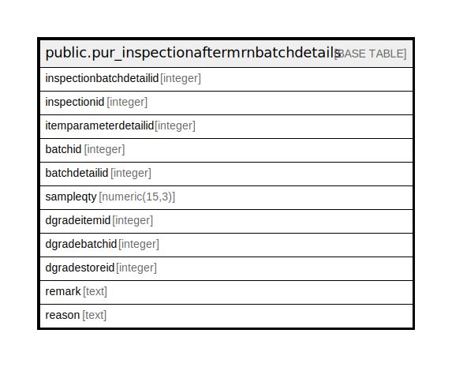

# public.pur_inspectionaftermrnbatchdetails

## Description

## Columns

| Name | Type | Default | Nullable | Children | Parents | Comment |
| ---- | ---- | ------- | -------- | -------- | ------- | ------- |
| inspectionbatchdetailid | integer | nextval('pur_inspectionaftermrnbatchdetails_inspectionbatchdetailid_seq'::regclass) | false |  |  |  |
| inspectionid | integer |  | true |  |  |  |
| itemparameterdetailid | integer |  | true |  |  |  |
| batchid | integer |  | true |  |  |  |
| batchdetailid | integer |  | true |  |  |  |
| sampleqty | numeric(15,3) | 0 | false |  |  |  |
| dgradeitemid | integer |  | true |  |  |  |
| dgradebatchid | integer |  | true |  |  |  |
| dgradestoreid | integer |  | true |  |  |  |
| remark | text |  | true |  |  |  |
| reason | text |  | true |  |  |  |

## Constraints

| Name | Type | Definition |
| ---- | ---- | ---------- |
| pur_inspectionaftermrnbatchdetails_pkey | PRIMARY KEY | PRIMARY KEY (inspectionbatchdetailid) |

## Indexes

| Name | Definition |
| ---- | ---------- |
| pur_inspectionaftermrnbatchdetails_pkey | CREATE UNIQUE INDEX pur_inspectionaftermrnbatchdetails_pkey ON public.pur_inspectionaftermrnbatchdetails USING btree (inspectionbatchdetailid) |
| Index_IAM_BatDet_IAMIDParID | CREATE INDEX "Index_IAM_BatDet_IAMIDParID" ON public.pur_inspectionaftermrnbatchdetails USING btree (inspectionid, itemparameterdetailid) |
| Index_IAM_BatDet_ParID | CREATE INDEX "Index_IAM_BatDet_ParID" ON public.pur_inspectionaftermrnbatchdetails USING btree (itemparameterdetailid) |

## Relations

---

> Generated by [tbls](https://github.com/k1LoW/tbls)
