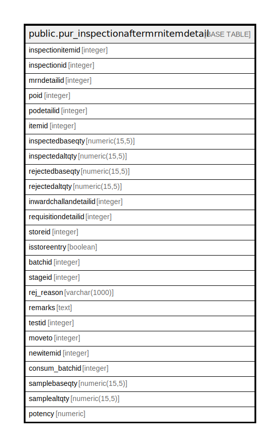

# public.pur_inspectionaftermrnitemdetail

## Description

## Columns

| Name | Type | Default | Nullable | Children | Parents | Comment |
| ---- | ---- | ------- | -------- | -------- | ------- | ------- |
| inspectionitemid | integer | nextval('pur_inspectionaftermrnitemdetail_inspectionitemid_seq'::regclass) | false |  |  |  |
| inspectionid | integer |  | true |  |  |  |
| mrndetailid | integer |  | true |  |  |  |
| poid | integer |  | true |  |  |  |
| podetailid | integer |  | true |  |  |  |
| itemid | integer |  | true |  |  |  |
| inspectedbaseqty | numeric(15,5) |  | true |  |  |  |
| inspectedaltqty | numeric(15,5) |  | true |  |  |  |
| rejectedbaseqty | numeric(15,5) |  | true |  |  |  |
| rejectedaltqty | numeric(15,5) |  | true |  |  |  |
| inwardchallandetailid | integer |  | true |  |  |  |
| requisitiondetailid | integer |  | true |  |  |  |
| storeid | integer |  | true |  |  |  |
| isstoreentry | boolean |  | true |  |  |  |
| batchid | integer |  | true |  |  |  |
| stageid | integer |  | true |  |  |  |
| rej_reason | varchar(1000) | ''::character varying | true |  |  |  |
| remarks | text |  | true |  |  |  |
| testid | integer |  | true |  |  |  |
| moveto | integer |  | true |  |  |  |
| newitemid | integer |  | true |  |  |  |
| consum_batchid | integer |  | true |  |  |  |
| samplebaseqty | numeric(15,5) |  | true |  |  |  |
| samplealtqty | numeric(15,5) |  | true |  |  |  |
| potency | numeric |  | true |  |  |  |

## Constraints

| Name | Type | Definition |
| ---- | ---- | ---------- |
| pur_inspectionaftermrnitem_pkey | PRIMARY KEY | PRIMARY KEY (inspectionitemid) |

## Indexes

| Name | Definition |
| ---- | ---------- |
| pur_inspectionaftermrnitem_pkey | CREATE UNIQUE INDEX pur_inspectionaftermrnitem_pkey ON public.pur_inspectionaftermrnitemdetail USING btree (inspectionitemid) |
| Index_IAM_Det_IAMID | CREATE INDEX "Index_IAM_Det_IAMID" ON public.pur_inspectionaftermrnitemdetail USING btree (inspectionid) |

## Relations

---

> Generated by [tbls](https://github.com/k1LoW/tbls)
