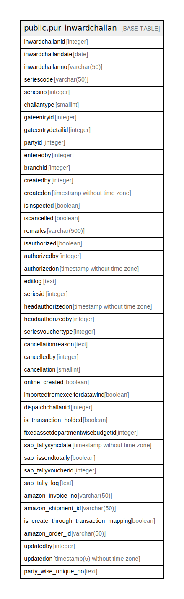

# public.pur_inwardchallan

## Description

## Columns

| Name | Type | Default | Nullable | Children | Parents | Comment |
| ---- | ---- | ------- | -------- | -------- | ------- | ------- |
| inwardchallanid | integer | nextval('pur_inwardchallan_inwardchallanid_seq'::regclass) | false |  |  |  |
| inwardchallandate | date |  | true |  |  |  |
| inwardchallanno | varchar(50) |  | true |  |  |  |
| seriescode | varchar(50) |  | true |  |  |  |
| seriesno | integer |  | true |  |  |  |
| challantype | smallint |  | true |  |  | 1=PO 2=With out po 3=job work 4=work order 5=FA 6=RGP 7=FAWOPO 8=SRCI 9=TC 10=RGP Insource 11=NRGP Challan |
| gateentryid | integer |  | true |  |  |  |
| gateentrydetailid | integer |  | true |  |  |  |
| partyid | integer |  | true |  |  |  |
| enteredby | integer |  | true |  |  |  |
| branchid | integer |  | true |  |  |  |
| createdby | integer |  | true |  |  |  |
| createdon | timestamp without time zone | now() | true |  |  |  |
| isinspected | boolean |  | true |  |  |  |
| iscancelled | boolean |  | true |  |  |  |
| remarks | varchar(500) |  | true |  |  |  |
| isauthorized | boolean |  | true |  |  |  |
| authorizedby | integer |  | true |  |  |  |
| authorizedon | timestamp without time zone |  | true |  |  |  |
| editlog | text |  | true |  |  |  |
| seriesid | integer |  | true |  |  |  |
| headauthorizedon | timestamp without time zone |  | true |  |  |  |
| headauthorizedby | integer |  | true |  |  |  |
| seriesvouchertype | integer | 0 | true |  |  |  |
| cancellationreason | text |  | true |  |  |  |
| cancelledby | integer |  | true |  |  |  |
| cancellation | smallint | 0 | true |  |  |  |
| online_created | boolean | false | true |  |  |  |
| importedfromexcelfordatawind | boolean | false | false |  |  |  |
| dispatchchallanid | integer |  | true |  |  | Jobwork Dispatch ID |
| is_transaction_holded | boolean | false | true |  |  |  |
| fixedassetdepartmentwisebudgetid | integer |  | true |  |  |  |
| sap_tallysyncdate | timestamp without time zone |  | true |  |  |  |
| sap_issendtotally | boolean | false | false |  |  |  |
| sap_tallyvoucherid | integer | 0 | false |  |  |  |
| sap_tally_log | text |  | true |  |  |  |
| amazon_invoice_no | varchar(50) | ''::character varying | true |  |  |  |
| amazon_shipment_id | varchar(50) | ''::character varying | true |  |  |  |
| is_create_through_transaction_mapping | boolean | false | true |  |  |  |
| amazon_order_id | varchar(50) |  | true |  |  |  |
| updatedby | integer |  | true |  |  |  |
| updatedon | timestamp(6) without time zone | NULL::timestamp without time zone | true |  |  |  |
| party_wise_unique_no | text |  | true |  |  |  |

## Constraints

| Name | Type | Definition |
| ---- | ---- | ---------- |
| pur_inwardchallan_gateentrydetailid_key | UNIQUE | UNIQUE (gateentrydetailid, iscancelled, cancellation) |
| pur_inwardchallan_pkey | PRIMARY KEY | PRIMARY KEY (inwardchallanid) |

## Indexes

| Name | Definition |
| ---- | ---------- |
| pur_inwardchallan_gateentrydetailid_key | CREATE UNIQUE INDEX pur_inwardchallan_gateentrydetailid_key ON public.pur_inwardchallan USING btree (gateentrydetailid, iscancelled, cancellation) |
| pur_inwardchallan_pkey | CREATE UNIQUE INDEX pur_inwardchallan_pkey ON public.pur_inwardchallan USING btree (inwardchallanid) |
| Index_Inward_Active | CREATE INDEX "Index_Inward_Active" ON public.pur_inwardchallan USING btree (inwardchallanid, branchid) WHERE (iscancelled = false) |
| ui_inwardchalan_no | CREATE UNIQUE INDEX ui_inwardchalan_no ON public.pur_inwardchallan USING btree (branchid, challantype, inwardchallandate, inwardchallanno) WHERE (inwardchallanid > 0) |

## Relations

---

> Generated by [tbls](https://github.com/k1LoW/tbls)
