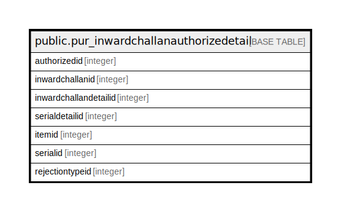

# public.pur_inwardchallanauthorizedetail

## Description

## Columns

| Name | Type | Default | Nullable | Children | Parents | Comment |
| ---- | ---- | ------- | -------- | -------- | ------- | ------- |
| authorizedid | integer | nextval('pur_inwardchallanauthorizedetail_authorizedid_seq'::regclass) | false |  |  |  |
| inwardchallanid | integer |  | true |  |  |  |
| inwardchallandetailid | integer |  | true |  |  |  |
| serialdetailid | integer |  | true |  |  |  |
| itemid | integer |  | true |  |  |  |
| serialid | integer |  | true |  |  |  |
| rejectiontypeid | integer |  | true |  |  |  |

## Constraints

| Name | Type | Definition |
| ---- | ---- | ---------- |
| pur_inwardchallanauthorizedetail_pkey | PRIMARY KEY | PRIMARY KEY (authorizedid) |

## Indexes

| Name | Definition |
| ---- | ---------- |
| pur_inwardchallanauthorizedetail_pkey | CREATE UNIQUE INDEX pur_inwardchallanauthorizedetail_pkey ON public.pur_inwardchallanauthorizedetail USING btree (authorizedid) |

## Relations

---

> Generated by [tbls](https://github.com/k1LoW/tbls)
