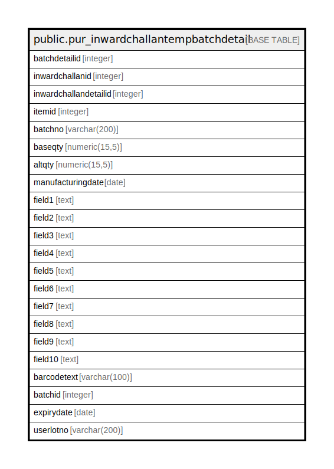

# public.pur_inwardchallantempbatchdetail

## Description

## Columns

| Name | Type | Default | Nullable | Children | Parents | Comment |
| ---- | ---- | ------- | -------- | -------- | ------- | ------- |
| batchdetailid | integer | nextval('pur_inwardchallantempbatchdetail_batchdetailid_seq'::regclass) | false |  |  |  |
| inwardchallanid | integer |  | true |  |  |  |
| inwardchallandetailid | integer |  | true |  |  |  |
| itemid | integer |  | true |  |  |  |
| batchno | varchar(200) |  | true |  |  |  |
| baseqty | numeric(15,5) |  | true |  |  |  |
| altqty | numeric(15,5) |  | true |  |  |  |
| manufacturingdate | date |  | true |  |  |  |
| field1 | text |  | true |  |  | gross weight |
| field2 | text |  | true |  |  | line no |
| field3 | text |  | true |  |  |  |
| field4 | text |  | true |  |  |  |
| field5 | text |  | true |  |  |  |
| field6 | text |  | true |  |  |  |
| field7 | text |  | true |  |  |  |
| field8 | text |  | true |  |  |  |
| field9 | text |  | true |  |  |  |
| field10 | text |  | true |  |  |  |
| barcodetext | varchar(100) |  | true |  |  |  |
| batchid | integer |  | true |  |  |  |
| expirydate | date |  | true |  |  |  |
| userlotno | varchar(200) | NULL::character varying | true |  |  |  |

## Constraints

| Name | Type | Definition |
| ---- | ---- | ---------- |
| pur_inwardchallantempbatchdetail_pkey | PRIMARY KEY | PRIMARY KEY (batchdetailid) |

## Indexes

| Name | Definition |
| ---- | ---------- |
| pur_inwardchallantempbatchdetail_pkey | CREATE UNIQUE INDEX pur_inwardchallantempbatchdetail_pkey ON public.pur_inwardchallantempbatchdetail USING btree (batchdetailid) |
| Index_Inward_Batch | CREATE INDEX "Index_Inward_Batch" ON public.pur_inwardchallantempbatchdetail USING btree (batchno, field2) |

## Relations

---

> Generated by [tbls](https://github.com/k1LoW/tbls)
