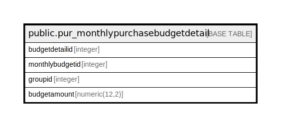

# public.pur_monthlypurchasebudgetdetail

## Description

## Columns

| Name | Type | Default | Nullable | Children | Parents | Comment |
| ---- | ---- | ------- | -------- | -------- | ------- | ------- |
| budgetdetailid | integer | nextval('pur_monthlypurchasebudgetdetail_budgetdetailid_seq'::regclass) | false |  |  |  |
| monthlybudgetid | integer |  | true |  |  |  |
| groupid | integer |  | true |  |  |  |
| budgetamount | numeric(12,2) |  | true |  |  |  |

## Constraints

| Name | Type | Definition |
| ---- | ---- | ---------- |
| pur_monthlypurchasebudgetdetail_pkey | PRIMARY KEY | PRIMARY KEY (budgetdetailid) |

## Indexes

| Name | Definition |
| ---- | ---------- |
| pur_monthlypurchasebudgetdetail_pkey | CREATE UNIQUE INDEX pur_monthlypurchasebudgetdetail_pkey ON public.pur_monthlypurchasebudgetdetail USING btree (budgetdetailid) |

## Relations

---

> Generated by [tbls](https://github.com/k1LoW/tbls)
