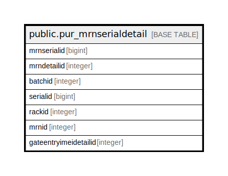

# public.pur_mrnserialdetail

## Description

## Columns

| Name | Type | Default | Nullable | Children | Parents | Comment |
| ---- | ---- | ------- | -------- | -------- | ------- | ------- |
| mrnserialid | bigint | nextval('pur_mrnserialdetail_mrnserialid_seq'::regclass) | false |  |  |  |
| mrndetailid | integer |  | true |  |  |  |
| batchid | integer |  | true |  |  |  |
| serialid | bigint |  | true |  |  |  |
| rackid | integer | 0 | true |  |  |  |
| mrnid | integer | 0 | true |  |  |  |
| gateentryimeidetailid | integer |  | true |  |  |  |

## Constraints

| Name | Type | Definition |
| ---- | ---- | ---------- |
| pur_mrnserialdetail_pkey | PRIMARY KEY | PRIMARY KEY (mrnserialid) |

## Indexes

| Name | Definition |
| ---- | ---------- |
| pur_mrnserialdetail_pkey | CREATE UNIQUE INDEX pur_mrnserialdetail_pkey ON public.pur_mrnserialdetail USING btree (mrnserialid) |
| Index_MRN_SerDet_DetID | CREATE INDEX "Index_MRN_SerDet_DetID" ON public.pur_mrnserialdetail USING btree (mrndetailid) |
| Index_MRN_SerDet_MRNIDDetID | CREATE INDEX "Index_MRN_SerDet_MRNIDDetID" ON public.pur_mrnserialdetail USING btree (mrnid, mrndetailid) |

## Relations

---

> Generated by [tbls](https://github.com/k1LoW/tbls)
