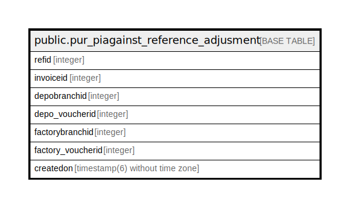

# public.pur_piagainst_reference_adjusment

## Description

## Columns

| Name | Type | Default | Nullable | Children | Parents | Comment |
| ---- | ---- | ------- | -------- | -------- | ------- | ------- |
| refid | integer | nextval('pur_piagainst_reference_adjusment_refid_seq'::regclass) | false |  |  |  |
| invoiceid | integer |  | true |  |  |  |
| depobranchid | integer |  | true |  |  |  |
| depo_voucherid | integer |  | true |  |  |  |
| factorybranchid | integer |  | true |  |  |  |
| factory_voucherid | integer |  | true |  |  |  |
| createdon | timestamp(6) without time zone | now() | true |  |  |  |

## Constraints

| Name | Type | Definition |
| ---- | ---- | ---------- |
| pur_piagainst_reference_adjusment_pkey | PRIMARY KEY | PRIMARY KEY (refid) |

## Indexes

| Name | Definition |
| ---- | ---------- |
| pur_piagainst_reference_adjusment_pkey | CREATE UNIQUE INDEX pur_piagainst_reference_adjusment_pkey ON public.pur_piagainst_reference_adjusment USING btree (refid) |

## Relations

---

> Generated by [tbls](https://github.com/k1LoW/tbls)
