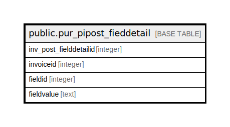

# public.pur_pipost_fieddetail

## Description

## Columns

| Name | Type | Default | Nullable | Children | Parents | Comment |
| ---- | ---- | ------- | -------- | -------- | ------- | ------- |
| inv_post_fielddetailid | integer | nextval('pur_pipost_fieddetail_inv_post_fielddetailid_seq'::regclass) | false |  |  |  |
| invoiceid | integer |  | true |  |  |  |
| fieldid | integer |  | true |  |  |  |
| fieldvalue | text |  | true |  |  |  |

## Constraints

| Name | Type | Definition |
| ---- | ---- | ---------- |
| pur_pipost_fieddetail_pkey | PRIMARY KEY | PRIMARY KEY (inv_post_fielddetailid) |

## Indexes

| Name | Definition |
| ---- | ---------- |
| pur_pipost_fieddetail_pkey | CREATE UNIQUE INDEX pur_pipost_fieddetail_pkey ON public.pur_pipost_fieddetail USING btree (inv_post_fielddetailid) |
| Index_PI_PosFielDet_PIID | CREATE INDEX "Index_PI_PosFielDet_PIID" ON public.pur_pipost_fieddetail USING btree (invoiceid) |

## Relations

---

> Generated by [tbls](https://github.com/k1LoW/tbls)
