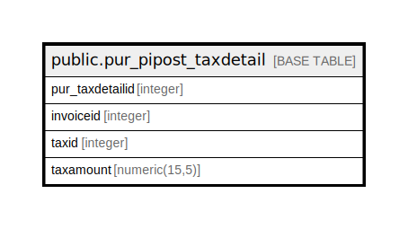

# public.pur_pipost_taxdetail

## Description

## Columns

| Name | Type | Default | Nullable | Children | Parents | Comment |
| ---- | ---- | ------- | -------- | -------- | ------- | ------- |
| pur_taxdetailid | integer | nextval('pur_taxdetail_pur_taxdetailid_seq'::regclass) | false |  |  |  |
| invoiceid | integer |  | true |  |  |  |
| taxid | integer |  | true |  |  |  |
| taxamount | numeric(15,5) |  | true |  |  |  |

## Constraints

| Name | Type | Definition |
| ---- | ---- | ---------- |
| pur_pipost_taxdetail_pkey | PRIMARY KEY | PRIMARY KEY (pur_taxdetailid) |

## Indexes

| Name | Definition |
| ---- | ---------- |
| pur_pipost_taxdetail_pkey | CREATE UNIQUE INDEX pur_pipost_taxdetail_pkey ON public.pur_pipost_taxdetail USING btree (pur_taxdetailid) |
| Index_PI_PosTaxDet_PIID | CREATE INDEX "Index_PI_PosTaxDet_PIID" ON public.pur_pipost_taxdetail USING btree (invoiceid) |
| Index_PurPostTax_InvId | CREATE INDEX "Index_PurPostTax_InvId" ON public.pur_pipost_taxdetail USING btree (invoiceid) |

## Relations

---

> Generated by [tbls](https://github.com/k1LoW/tbls)
