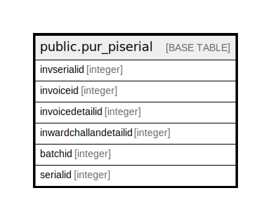

# public.pur_piserial

## Description

## Columns

| Name | Type | Default | Nullable | Children | Parents | Comment |
| ---- | ---- | ------- | -------- | -------- | ------- | ------- |
| invserialid | integer | nextval('pur_piserial_invserialid_seq'::regclass) | false |  |  |  |
| invoiceid | integer |  | true |  |  |  |
| invoicedetailid | integer |  | true |  |  |  |
| inwardchallandetailid | integer |  | true |  |  |  |
| batchid | integer |  | true |  |  |  |
| serialid | integer |  | true |  |  |  |

## Constraints

| Name | Type | Definition |
| ---- | ---- | ---------- |
| pur_piserial_pkey | PRIMARY KEY | PRIMARY KEY (invserialid) |

## Indexes

| Name | Definition |
| ---- | ---------- |
| pur_piserial_pkey | CREATE UNIQUE INDEX pur_piserial_pkey ON public.pur_piserial USING btree (invserialid) |
| Index_PI_SerDet_DetID | CREATE INDEX "Index_PI_SerDet_DetID" ON public.pur_piserial USING btree (invoicedetailid) |
| Index_PI_SerDet_PIIDDetID | CREATE INDEX "Index_PI_SerDet_PIIDDetID" ON public.pur_piserial USING btree (invoiceid, invoicedetailid) |

## Relations

---

> Generated by [tbls](https://github.com/k1LoW/tbls)
