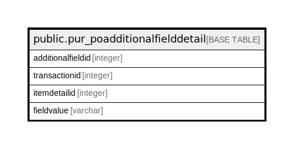

# public.pur_poadditionalfielddetail

## Description

## Columns

| Name | Type | Default | Nullable | Children | Parents | Comment |
| ---- | ---- | ------- | -------- | -------- | ------- | ------- |
| additionalfieldid | integer | nextval('pur_poadditionalfielddetail_additionalfieldid_seq'::regclass) | false |  |  |  |
| transactionid | integer |  | false |  |  |  |
| itemdetailid | integer |  | false |  |  |  |
| fieldvalue | varchar |  | true |  |  |  |

## Constraints

| Name | Type | Definition |
| ---- | ---- | ---------- |
| pur_additionalfielddetail_pkey | PRIMARY KEY | PRIMARY KEY (additionalfieldid) |

## Indexes

| Name | Definition |
| ---- | ---------- |
| pur_additionalfielddetail_pkey | CREATE UNIQUE INDEX pur_additionalfielddetail_pkey ON public.pur_poadditionalfielddetail USING btree (additionalfieldid) |

## Relations

---

> Generated by [tbls](https://github.com/k1LoW/tbls)
