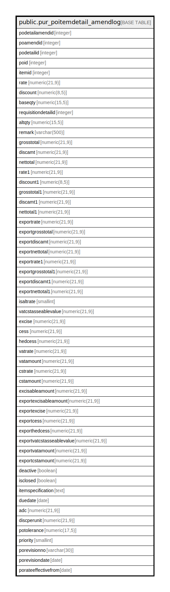

# public.pur_poitemdetail_amendlog

## Description

## Columns

| Name | Type | Default | Nullable | Children | Parents | Comment |
| ---- | ---- | ------- | -------- | -------- | ------- | ------- |
| podetailamendid | integer | nextval('pur_poitemdetail_amendlog_podetailamendid_seq'::regclass) | false |  |  |  |
| poamendid | integer |  | false |  |  |  |
| podetailid | integer |  | false |  |  |  |
| poid | integer |  | true |  |  |  |
| itemid | integer |  | true |  |  |  |
| rate | numeric(21,9) |  | true |  |  |  |
| discount | numeric(8,5) |  | true |  |  |  |
| baseqty | numeric(15,5) |  | true |  |  |  |
| requisitiondetailid | integer |  | true |  |  |  |
| altqty | numeric(15,5) |  | true |  |  |  |
| remark | varchar(500) | NULL::character varying | true |  |  |  |
| grosstotal | numeric(21,9) | NULL::numeric | true |  |  |  |
| discamt | numeric(21,9) | NULL::numeric | true |  |  |  |
| nettotal | numeric(21,9) | NULL::numeric | true |  |  |  |
| rate1 | numeric(21,9) | NULL::numeric | true |  |  |  |
| discount1 | numeric(8,5) | NULL::numeric | true |  |  |  |
| grosstotal1 | numeric(21,9) | NULL::numeric | true |  |  |  |
| discamt1 | numeric(21,9) | NULL::numeric | true |  |  |  |
| nettotal1 | numeric(21,9) | NULL::numeric | true |  |  |  |
| exportrate | numeric(21,9) | 0 | true |  |  |  |
| exportgrosstotal | numeric(21,9) | 0 | true |  |  |  |
| exportdiscamt | numeric(21,9) | 0 | true |  |  |  |
| exportnettotal | numeric(21,9) | 0 | true |  |  |  |
| exportrate1 | numeric(21,9) | 0 | true |  |  |  |
| exportgrosstotal1 | numeric(21,9) | 0 | true |  |  |  |
| exportdiscamt1 | numeric(21,9) | 0 | true |  |  |  |
| exportnettotal1 | numeric(21,9) | 0 | true |  |  |  |
| isaltrate | smallint |  | true |  |  |  |
| vatcstasseablevalue | numeric(21,9) | 0 | true |  |  |  |
| excise | numeric(21,9) | 0 | true |  |  |  |
| cess | numeric(21,9) | 0 | true |  |  |  |
| hedcess | numeric(21,9) | 0 | true |  |  |  |
| vatrate | numeric(21,9) | 0 | true |  |  |  |
| vatamount | numeric(21,9) | 0 | true |  |  |  |
| cstrate | numeric(21,9) | 0 | true |  |  |  |
| cstamount | numeric(21,9) | 0 | true |  |  |  |
| excisableamount | numeric(21,9) | 0 | true |  |  |  |
| exportexcisableamount | numeric(21,9) | 0 | true |  |  |  |
| exportexcise | numeric(21,9) | 0 | true |  |  |  |
| exportcess | numeric(21,9) | 0 | true |  |  |  |
| exporthedcess | numeric(21,9) | 0 | true |  |  |  |
| exportvatcstasseablevalue | numeric(21,9) | 0 | true |  |  |  |
| exportvatamount | numeric(21,9) | 0 | true |  |  |  |
| exportcstamount | numeric(21,9) | 0 | true |  |  |  |
| deactive | boolean | false | true |  |  |  |
| isclosed | boolean | false | true |  |  |  |
| itemspecification | text |  | true |  |  |  |
| duedate | date |  | true |  |  |  |
| adc | numeric(21,9) | 0 | true |  |  |  |
| discperunit | numeric(21,9) |  | true |  |  |  |
| potolerance | numeric(17,5) |  | true |  |  |  |
| priority | smallint | 3 | true |  |  |  |
| porevisionno | varchar(30) |  | true |  |  |  |
| porevisiondate | date |  | true |  |  |  |
| porateeffectivefrom | date |  | true |  |  |  |

## Constraints

| Name | Type | Definition |
| ---- | ---- | ---------- |
| pur_poitemdetail_amendlog_pkey | PRIMARY KEY | PRIMARY KEY (podetailamendid) |

## Indexes

| Name | Definition |
| ---- | ---------- |
| pur_poitemdetail_amendlog_pkey | CREATE UNIQUE INDEX pur_poitemdetail_amendlog_pkey ON public.pur_poitemdetail_amendlog USING btree (podetailamendid) |
| Index_POItmDet_PODetID | CREATE INDEX "Index_POItmDet_PODetID" ON public.pur_poitemdetail_amendlog USING btree (podetailid) |
| Index_POItmDet_POID | CREATE INDEX "Index_POItmDet_POID" ON public.pur_poitemdetail_amendlog USING btree (poid) |

## Relations

---

> Generated by [tbls](https://github.com/k1LoW/tbls)
