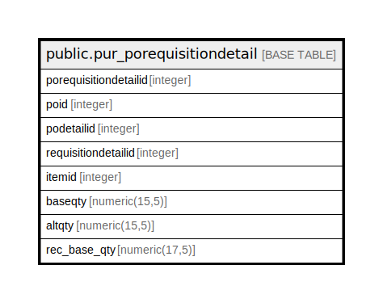

# public.pur_porequisitiondetail

## Description

## Columns

| Name | Type | Default | Nullable | Children | Parents | Comment |
| ---- | ---- | ------- | -------- | -------- | ------- | ------- |
| porequisitiondetailid | integer | nextval('pur_porequisitiondetail_porequisitiondetailid_seq'::regclass) | false |  |  |  |
| poid | integer |  | true |  |  |  |
| podetailid | integer |  | true |  |  |  |
| requisitiondetailid | integer |  | true |  |  |  |
| itemid | integer |  | true |  |  |  |
| baseqty | numeric(15,5) |  | true |  |  |  |
| altqty | numeric(15,5) |  | true |  |  |  |
| rec_base_qty | numeric(17,5) | 0 | true |  |  |  |

## Constraints

| Name | Type | Definition |
| ---- | ---- | ---------- |
| pur_porequisitiondetail_pkey | PRIMARY KEY | PRIMARY KEY (porequisitiondetailid) |

## Indexes

| Name | Definition |
| ---- | ---------- |
| pur_porequisitiondetail_pkey | CREATE UNIQUE INDEX pur_porequisitiondetail_pkey ON public.pur_porequisitiondetail USING btree (porequisitiondetailid) |

## Relations

---

> Generated by [tbls](https://github.com/k1LoW/tbls)
