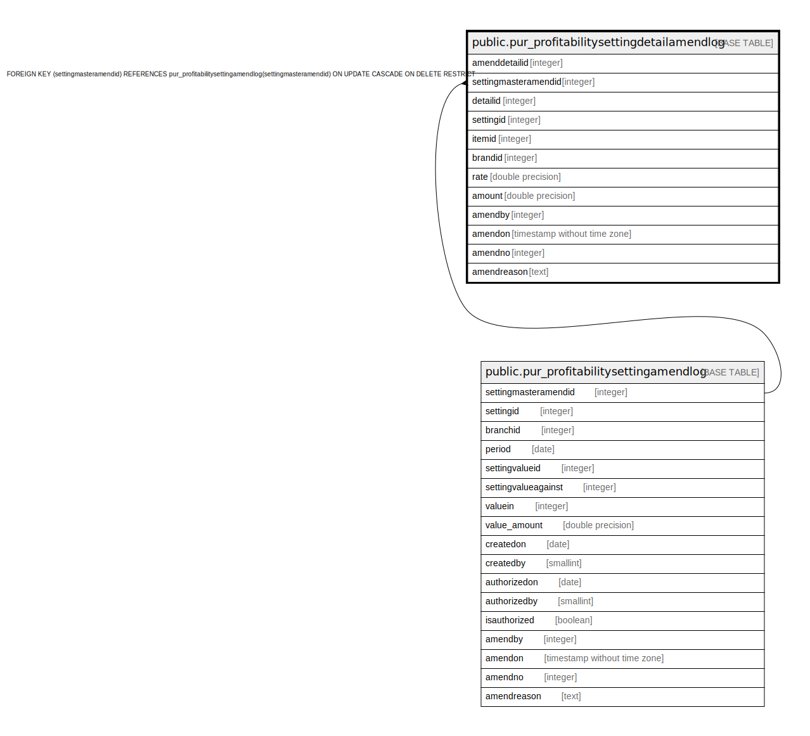

# public.pur_profitabilitysettingdetailamendlog

## Description

## Columns

| Name | Type | Default | Nullable | Children | Parents | Comment |
| ---- | ---- | ------- | -------- | -------- | ------- | ------- |
| amenddetailid | integer | nextval('pur_profitabilitysettingdetailamendlog_amenddetailid_seq'::regclass) | false |  |  |  |
| settingmasteramendid | integer |  | true |  | [public.pur_profitabilitysettingamendlog](public.pur_profitabilitysettingamendlog.md) |  |
| detailid | integer |  | true |  |  |  |
| settingid | integer |  | true |  |  |  |
| itemid | integer |  | true |  |  |  |
| brandid | integer |  | true |  |  |  |
| rate | double precision |  | true |  |  |  |
| amount | double precision |  | true |  |  |  |
| amendby | integer |  | true |  |  |  |
| amendon | timestamp without time zone |  | true |  |  |  |
| amendno | integer |  | true |  |  |  |
| amendreason | text |  | true |  |  |  |

## Constraints

| Name | Type | Definition |
| ---- | ---- | ---------- |
| profitabilitysettingamendlog_FK | FOREIGN KEY | FOREIGN KEY (settingmasteramendid) REFERENCES pur_profitabilitysettingamendlog(settingmasteramendid) ON UPDATE CASCADE ON DELETE RESTRICT |
| pur_profitabilitysettingdetailamendlog_pkey | PRIMARY KEY | PRIMARY KEY (amenddetailid) |

## Indexes

| Name | Definition |
| ---- | ---------- |
| pur_profitabilitysettingdetailamendlog_pkey | CREATE UNIQUE INDEX pur_profitabilitysettingdetailamendlog_pkey ON public.pur_profitabilitysettingdetailamendlog USING btree (amenddetailid) |

## Relations

---

> Generated by [tbls](https://github.com/k1LoW/tbls)
