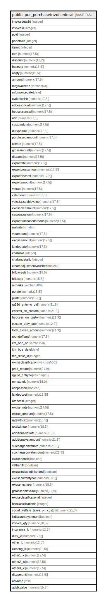

# public.pur_purchaseinvoicedetail

## Description

## Columns

| Name | Type | Default | Nullable | Children | Parents | Comment |
| ---- | ---- | ------- | -------- | -------- | ------- | ------- |
| invoicedetailid | integer | nextval('pur_purchaseinvoicedetail_invoicedetailid_seq'::regclass) | false |  |  |  |
| invoiceid | integer |  | true |  |  |  |
| poid | integer |  | true |  |  |  |
| podetailid | integer |  | true |  |  |  |
| itemid | integer |  | true |  |  |  |
| rate | numeric(17,5) | NULL::numeric | true |  |  |  |
| discount | numeric(12,2) | NULL::numeric | true |  |  |  |
| baseqty | numeric(15,5) | NULL::numeric | true |  |  |  |
| altqty | numeric(15,5) | NULL::numeric | true |  |  |  |
| amount | numeric(17,5) | NULL::numeric | true |  |  |  |
| mfginvoiceno | varchar(50) | NULL::character varying | true |  |  |  |
| mfginvoicedate | date |  | true |  |  |  |
| cvdorexcise | numeric(17,5) | NULL::numeric | true |  |  |  |
| edcessoncvd | numeric(17,5) | NULL::numeric | true |  |  |  |
| hedcessoncvd | numeric(17,5) | NULL::numeric | true |  |  |  |
| adc | numeric(17,5) | NULL::numeric | true |  |  |  |
| customduty | numeric(17,5) | NULL::numeric | true |  |  |  |
| dutyperunit | numeric(17,5) | NULL::numeric | true |  |  |  |
| purchasedamount | numeric(17,5) | NULL::numeric | true |  |  |  |
| cstrate | numeric(17,5) | NULL::numeric | true |  |  |  |
| grossamount | numeric(17,5) |  | true |  |  |  |
| discamt | numeric(17,5) |  | true |  |  |  |
| exportrate | numeric(17,5) |  | true |  |  |  |
| exportgrossamount | numeric(17,5) |  | true |  |  |  |
| exportdiscamt | numeric(17,5) |  | true |  |  |  |
| exportamount | numeric(17,5) |  | true |  |  |  |
| vatrate | numeric(17,5) | NULL::numeric | true |  |  |  |
| cstamount | numeric(17,5) | NULL::numeric | true |  |  |  |
| vatcstasseablevalue | numeric(17,5) | NULL::numeric | true |  |  |  |
| excisableamount | numeric(17,5) | NULL::numeric | true |  |  |  |
| cessoncustom | numeric(17,5) | NULL::numeric | true |  |  |  |
| exportpurchasedamount | numeric(17,5) | NULL::numeric | true |  |  |  |
| isaltrate | smallint |  | true |  |  |  |
| vatamount | numeric(17,5) | 0 | true |  |  |  |
| exciseamount | numeric(17,5) | 0 | true |  |  |  |
| landedrate | numeric(17,5) | 0 | true |  |  |  |
| challanid | integer |  | true |  |  |  |
| challandetailid | integer |  | true |  |  |  |
| createadjustmentvoucher | boolean | false | true |  |  |  |
| billbaseqty | numeric(15,5) | 0 | true |  |  |  |
| billaltqty | numeric(15,5) | 0 | true |  |  |  |
| remarks | varchar(500) |  | true |  |  |  |
| porate | numeric(15,5) | 0 | true |  |  | To Save po Rate for display in Credit Note Journal Voucher(PO & Invoice Rate Diff. Adjustment) |
| pirate | numeric(15,5) | 0 | true |  |  | To Save pi Rate for display in Credit Note Journal Voucher(PO & Invoice Rate Diff. Adjustment) |
| rg23d_entryno_old | numeric(21,9) | NULL::numeric | true |  |  |  |
| edcess_on_custom | numeric(21,9) | 0 | true |  |  |  |
| hedcess_on_custom | numeric(21,9) | 0 | true |  |  |  |
| custom_duty_rate | numeric(12,2) | 0 | true |  |  |  |
| total_excise_amount | numeric(21,9) | 0 | true |  |  |  |
| roundoffamt | numeric(17,5) | 0 | true |  |  |  |
| itm_boe_no | varchar(50) |  | true |  |  |  |
| itm_boe_date | date |  | true |  |  |  |
| teo_store_id | integer |  | true |  |  |  |
| exciseclassification | varchar(500) | ''::character varying | true |  |  |  |
| prod_rebate | numeric(21,9) | 0.0 | true |  |  | CreditNote (Sales Return) to Save the Value of SalesInvoice Product_RebateRate * Credit Note Alt.Qty |
| rg23d_entryno | varchar(20) |  | true |  |  |  |
| mrnstoreid | numeric(18,0) |  | true |  |  |  |
| adcpasson | boolean | true | true |  |  |  |
| landedcost | numeric(18,5) |  | true |  |  |  |
| licenceid | integer |  | true |  |  |  |
| excise_rate | numeric(17,5) | NULL::numeric | true |  |  | For Item Excise Ledger |
| excise_amount | numeric(17,5) | NULL::numeric | true |  |  | For Item Excise Ledger |
| ratewithtax | numeric(18,5) | 0 | true |  |  |  |
| totalwithtax | numeric(18,5) | 0 | true |  |  |  |
| additionalvatrate | numeric(21,9) | 0 | true |  |  |  |
| additionalvatamount | numeric(21,9) | 0 | true |  |  |  |
| surchargeonvatrate | numeric(21,9) | 0 | true |  |  |  |
| surchargeonvatamount | numeric(21,9) | 0 | true |  |  |  |
| excisebenifit | boolean | true | true |  |  |  |
| vatbenifit | boolean | true | true |  |  |  |
| exciseincludedinlanded | boolean | true | true |  |  |  |
| excisecurrentyear | numeric(18,5) | 0 | true |  |  |  |
| excisenextyear | numeric(18,5) | 0 | true |  |  |  |
| gstasseablevalue | numeric(21,9) |  | true |  |  |  |
| exciseclassificationid | integer |  | true |  |  |  |
| hsnclassificationid | integer |  | true |  |  |  |
| social_welfare_taxes_on_custom | numeric(21,3) | 0 | true |  |  |  |
| isdiscountbyamount | boolean | false | true |  |  |  |
| invoice_qty | numeric(20,5) |  | true |  |  |  |
| insurance_lc | numeric(12,5) | 0 | true |  |  |  |
| duty_lc | numeric(12,5) | 0 | true |  |  |  |
| other_lc | numeric(12,5) | 0 | true |  |  |  |
| clearing_lc | numeric(12,5) | 0 | true |  |  |  |
| other1_lc | numeric(12,5) | 0 | true |  |  |  |
| other2_lc | numeric(12,5) | 0 | true |  |  |  |
| other3_lc | numeric(12,5) | 0 | true |  |  |  |
| discperunit | numeric(15,5) | 0 | true |  |  |  |
| advlicno | text |  | true |  |  |  |
| advlicvalue | numeric(15,2) |  | true |  |  |  |

## Constraints

| Name | Type | Definition |
| ---- | ---- | ---------- |
| pur_purchaseinvoicedetail_pkey | PRIMARY KEY | PRIMARY KEY (invoicedetailid) |

## Indexes

| Name | Definition |
| ---- | ---------- |
| pur_purchaseinvoicedetail_pkey | CREATE UNIQUE INDEX pur_purchaseinvoicedetail_pkey ON public.pur_purchaseinvoicedetail USING btree (invoicedetailid) |
| Index_PI_Det_PIID | CREATE INDEX "Index_PI_Det_PIID" ON public.pur_purchaseinvoicedetail USING btree (invoiceid) |
| Index_PU_Det_ChlnID | CREATE INDEX "Index_PU_Det_ChlnID" ON public.pur_purchaseinvoicedetail USING btree (challandetailid) |
| Index_PU_Det_InvID | CREATE INDEX "Index_PU_Det_InvID" ON public.pur_purchaseinvoicedetail USING btree (invoiceid) |
| Index_PU_Det_InvIDItemID | CREATE INDEX "Index_PU_Det_InvIDItemID" ON public.pur_purchaseinvoicedetail USING btree (invoiceid, itemid) |
| Index_PU_Det_ItemID | CREATE INDEX "Index_PU_Det_ItemID" ON public.pur_purchaseinvoicedetail USING btree (itemid) |

## Relations

---

> Generated by [tbls](https://github.com/k1LoW/tbls)
