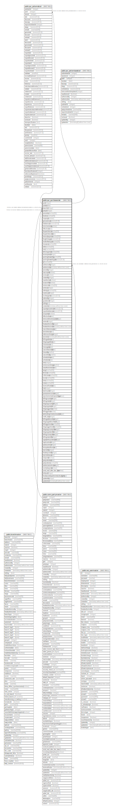

# public.pur_purchaseorder

## Description

## Columns

| Name | Type | Default | Nullable | Children | Parents | Comment |
| ---- | ---- | ------- | -------- | -------- | ------- | ------- |
| poid | integer | nextval('pur_purchaseorder_poid_seq'::regclass) | false | [public.pur_poitemdetail](public.pur_poitemdetail.md) [public.pur_poitemduedetail](public.pur_poitemduedetail.md) |  |  |
| podate | date |  | true |  |  |  |
| branchid | integer |  | true |  | [public.branchmaster](public.branchmaster.md) |  |
| partyid | integer |  | true |  | [public.comn_partymaster](public.comn_partymaster.md) |  |
| ponumber | varchar(50) |  | true |  |  |  |
| bookno | varchar(20) |  | true |  |  |  |
| isopenpo | boolean | true | true |  |  |  |
| grossamount | numeric(21,9) |  | true |  |  |  |
| totalamount | numeric(21,9) |  | true |  |  |  |
| isexciseonmrp | boolean |  | true |  |  |  |
| effectiveto | date |  | true |  |  |  |
| dispatchdocno | varchar(10) |  | true |  |  |  |
| dispatchdocdate | date |  | true |  |  |  |
| termsofpayment | varchar(200) |  | true |  |  |  |
| freightcharges | numeric(21,9) |  | true |  |  |  |
| modeoftransport | varchar(20) |  | true |  |  |  |
| insurance | varchar(30) |  | true |  |  |  |
| other | varchar(50) |  | true |  |  |  |
| note | varchar(100) |  | true |  |  |  |
| deliveryperiod | varchar(100) |  | true |  |  |  |
| taxtemplateid | integer |  | true |  |  |  |
| packingforwarding | varchar(30) |  | true |  |  |  |
| packingforwardingrate | numeric(21,9) |  | true |  |  |  |
| pf | varchar(20) |  | true |  |  |  |
| authorizedby | integer |  | true |  | [public.sec_usermaster](public.sec_usermaster.md) |  |
| authorizedon | timestamp without time zone |  | true |  |  |  |
| amendby | integer |  | true |  |  |  |
| isaccepted | boolean | false | true |  |  |  |
| isclosed | boolean | false | true |  |  |  |
| createdby | integer |  | true |  |  |  |
| isauthorized | boolean | false | true |  |  |  |
| iscancelled | boolean | false | true |  |  |  |
| seriescode | varchar(50) |  | true |  |  |  |
| seriesno | integer |  | true |  |  |  |
| ordertype | varchar(20) |  | true |  |  |  |
| currencyid | integer |  | true |  |  |  |
| exchangerate | numeric(21,9) |  | true |  |  |  |
| orderedby | integer |  | true |  |  |  |
| quotationid | integer |  | true |  |  |  |
| editlog | text |  | true |  |  |  |
| createdon | timestamp without time zone | now() | true |  |  |  |
| exportgrossamount | numeric(21,9) |  | true |  |  |  |
| exporttotalamount | numeric(21,9) |  | true |  |  |  |
| isexportpo | boolean | false | true |  |  |  |
| effectivefrom | date |  | true |  |  |  |
| termconditiontemplateid | integer |  | true |  |  |  |
| seriesid | integer |  | true |  |  |  |
| headauthorizedby | integer |  | true |  |  |  |
| headauthorizedon | timestamp without time zone |  | true |  |  |  |
| cancellationreason | text |  | true |  |  |  |
| amendreason | text |  | true |  |  |  |
| ordervouchertype | integer |  | true |  |  |  |
| amendon | timestamp(6) without time zone |  | true |  |  |  |
| billingaddress | text |  | true |  |  |  |
| shippingaddress | text |  | true |  |  |  |
| closereason | text |  | true |  |  |  |
| closingdate | date |  | true |  |  |  |
| cancellationdate | date |  | true |  |  |  |
| closedby | smallint |  | true |  |  |  |
| cancelledby | smallint |  | true |  |  |  |
| schedulefrom | date |  | true |  |  |  |
| scheduleto | date |  | true |  |  |  |
| srno | integer |  | true |  |  |  |
| seriesvouchertype | smallint | 0 | true |  |  |  |
| unauthorizereason | text |  | true |  |  |  |
| range | varchar(50) |  | true |  |  |  |
| division | varchar(50) |  | true |  |  |  |
| collectorate | varchar(50) |  | true |  |  |  |
| eccno | varchar(50) |  | true |  |  |  |
| lstno | varchar(50) |  | true |  |  |  |
| cstno | varchar(50) |  | true |  |  |  |
| lastmodifieddate | date | now() | true |  |  |  |
| lcid | integer |  | true |  |  |  |
| batchcardid | integer | 0 | false |  |  |  |
| pomasterrevisionno | integer |  | true |  |  |  |
| rejectionincludeinpendingpo | boolean | true | true |  |  |  |
| billingcountryid | integer |  | true |  |  |  |
| billingstateid | integer |  | true |  |  |  |
| shippingcountryid | integer |  | true |  |  |  |
| shippingstateid | integer |  | true |  |  |  |
| shippinggstinno | varchar |  | true |  |  |  |
| billinggstinno | varchar |  | true |  |  |  |
| workordergenerationmasterid | integer | 0 | false |  |  |  |
| credit_days | integer |  | true |  |  |  |
| billingaddressfrmid | integer |  | true |  |  |  |
| shippingaddressfrmid | integer |  | true |  |  |  |
| billinggstinnofrm | varchar(50) |  | true |  |  |  |
| shippinggstinnofrm | varchar(50) |  | true |  |  |  |
| shippingcountryidfrm | integer |  | true |  |  |  |
| shippingstateidfrm | integer |  | true |  |  |  |
| billingcountryidfrm | integer |  | true |  |  |  |
| billingstateidfrm | integer |  | true |  |  |  |
| sapwarehousedetailid | integer | 0 | false |  |  |  |
| saplocationid | integer | 0 | false |  |  |  |
| authorizelevel | integer | 0 | true |  |  |  |
| lastupdatedformula | text |  | true |  |  |  |
| rejectedby | integer |  | true |  |  |  |
| headrejectedby | integer |  | true |  |  |  |
| rejectedreason | text |  | true |  |  |  |
| isrejected | boolean | false | true |  |  |  |
| partyorderdate | date |  | true |  |  |  |
| partyorderno | varchar(50) |  | true |  |  |  |
| authorizationlevelid | integer | 0 | true |  |  |  |
| isinitialrejected | boolean | false | true |  |  |  |
| send_mail_after_due_date | boolean | false | true |  |  |  |
| bulkpoid | integer | 0 | true |  |  |  |
| fixedassetdepartmentwisebudgetid | integer | 0 | true |  |  |  |
| updatedby | integer |  | true |  |  |  |
| updatedon | timestamp(6) without time zone | NULL::timestamp without time zone | true |  |  |  |

## Constraints

| Name | Type | Definition |
| ---- | ---- | ---------- |
| pomaster_fk | FOREIGN KEY | FOREIGN KEY (branchid) REFERENCES branchmaster(branchid) ON UPDATE CASCADE |
| pomaster_fk1 | FOREIGN KEY | FOREIGN KEY (partyid) REFERENCES comn_partymaster(partyid) ON UPDATE CASCADE |
| pomaster_pkey | PRIMARY KEY | PRIMARY KEY (poid) |
| pomaster_fk2 | FOREIGN KEY | FOREIGN KEY (authorizedby) REFERENCES sec_usermaster(id) ON UPDATE CASCADE |

## Indexes

| Name | Definition |
| ---- | ---------- |
| pomaster_pkey | CREATE UNIQUE INDEX pomaster_pkey ON public.pur_purchaseorder USING btree (poid) |
| Index_PO_PartyID | CREATE INDEX "Index_PO_PartyID" ON public.pur_purchaseorder USING btree (partyid) |
| ui_purord_no | CREATE UNIQUE INDEX ui_purord_no ON public.pur_purchaseorder USING btree (branchid, ordertype, podate, ponumber) WHERE (poid > 0) |

## Triggers

| Name | Definition |
| ---- | ---------- |
| po_amend_log_entry | CREATE TRIGGER po_amend_log_entry BEFORE UPDATE ON public.pur_purchaseorder FOR EACH ROW EXECUTE FUNCTION po_amend_log_entry() |
| tgr_func_update_pur_req_pending_qty | CREATE TRIGGER tgr_func_update_pur_req_pending_qty AFTER UPDATE ON public.pur_purchaseorder FOR EACH ROW EXECUTE FUNCTION tgr_func_update_pur_req_pending_qty() |

## Relations

---

> Generated by [tbls](https://github.com/k1LoW/tbls)
