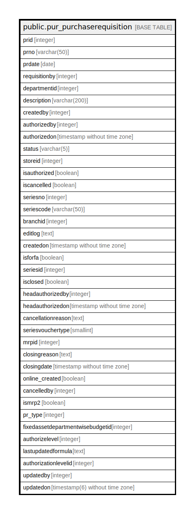

# public.pur_purchaserequisition

## Description

## Columns

| Name | Type | Default | Nullable | Children | Parents | Comment |
| ---- | ---- | ------- | -------- | -------- | ------- | ------- |
| prid | integer | nextval('pur_purchaserequisition_prid_seq'::regclass) | false |  |  |  |
| prno | varchar(50) |  | true |  |  |  |
| prdate | date |  | true |  |  |  |
| requisitionby | integer |  | true |  |  |  |
| departmentid | integer |  | true |  |  |  |
| description | varchar(200) |  | true |  |  |  |
| createdby | integer |  | true |  |  |  |
| authorizedby | integer |  | true |  |  |  |
| authorizedon | timestamp without time zone |  | true |  |  |  |
| status | varchar(5) |  | true |  |  |  |
| storeid | integer |  | true |  |  |  |
| isauthorized | boolean | false | false |  |  |  |
| iscancelled | boolean |  | false |  |  |  |
| seriesno | integer |  | true |  |  |  |
| seriescode | varchar(50) |  | true |  |  |  |
| branchid | integer |  | true |  |  |  |
| editlog | text |  | true |  |  |  |
| createdon | timestamp without time zone | now() | true |  |  |  |
| isforfa | boolean | false | true |  |  |  |
| seriesid | integer |  | true |  |  |  |
| isclosed | boolean | false | true |  |  |  |
| headauthorizedby | integer |  | true |  |  |  |
| headauthorizedon | timestamp without time zone |  | true |  |  |  |
| cancellationreason | text |  | true |  |  |  |
| seriesvouchertype | smallint | 0 | true |  |  |  |
| mrpid | integer |  | true |  |  |  |
| closingreason | text |  | true |  |  |  |
| closingdate | timestamp without time zone |  | true |  |  |  |
| online_created | boolean | false | true |  |  |  |
| cancelledby | integer |  | true |  |  |  |
| ismrp2 | boolean | false | true |  |  |  |
| pr_type | integer |  | true |  |  | 1 = From MRP 2 = From MRP2 3 = From SO 4 = Normal 5 = From Store Issue 6 = Store Requisition |
| fixedassetdepartmentwisebudgetid | integer | 0 | false |  |  |  |
| authorizelevel | integer | 0 | true |  |  |  |
| lastupdatedformula | text |  | true |  |  |  |
| authorizationlevelid | integer | 0 | true |  |  |  |
| updatedby | integer |  | true |  |  |  |
| updatedon | timestamp(6) without time zone | NULL::timestamp without time zone | true |  |  |  |

## Constraints

| Name | Type | Definition |
| ---- | ---- | ---------- |
| purchaserequisition_pkey | PRIMARY KEY | PRIMARY KEY (prid) |

## Indexes

| Name | Definition |
| ---- | ---------- |
| purchaserequisition_pkey | CREATE UNIQUE INDEX purchaserequisition_pkey ON public.pur_purchaserequisition USING btree (prid) |
| ui_purreq_no | CREATE UNIQUE INDEX ui_purreq_no ON public.pur_purchaserequisition USING btree (branchid, pr_type, prdate, prno) WHERE (prid > 0) |

## Relations

---

> Generated by [tbls](https://github.com/k1LoW/tbls)
