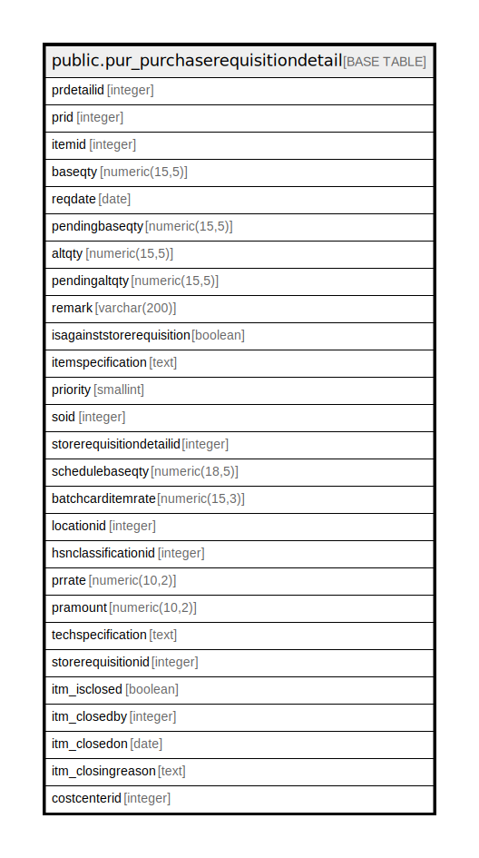

# public.pur_purchaserequisitiondetail

## Description

## Columns

| Name | Type | Default | Nullable | Children | Parents | Comment |
| ---- | ---- | ------- | -------- | -------- | ------- | ------- |
| prdetailid | integer | nextval('pur_purchaserequisitiondetail_prdetailid_seq'::regclass) | false |  |  |  |
| prid | integer |  | true |  |  |  |
| itemid | integer |  | true |  |  |  |
| baseqty | numeric(15,5) |  | true |  |  |  |
| reqdate | date |  | true |  |  |  |
| pendingbaseqty | numeric(15,5) |  | true |  |  |  |
| altqty | numeric(15,5) |  | true |  |  |  |
| pendingaltqty | numeric(15,5) |  | true |  |  |  |
| remark | varchar(200) |  | true |  |  |  |
| isagainststorerequisition | boolean | false | true |  |  | If(TRUE) item is against the store requisition then it is not editable |
| itemspecification | text |  | true |  |  |  |
| priority | smallint | 3 | true |  |  | 1--Most Urgent 2--Urgent 3--General |
| soid | integer |  | true |  |  |  |
| storerequisitiondetailid | integer |  | true |  |  |  |
| schedulebaseqty | numeric(18,5) | 0 | true |  |  |  |
| batchcarditemrate | numeric(15,3) | 0 | false |  |  |  |
| locationid | integer | 0 | false |  |  |  |
| hsnclassificationid | integer |  | true |  |  |  |
| prrate | numeric(10,2) |  | true |  |  |  |
| pramount | numeric(10,2) |  | true |  |  |  |
| techspecification | text |  | true |  |  |  |
| storerequisitionid | integer |  | true |  |  |  |
| itm_isclosed | boolean | false | true |  |  |  |
| itm_closedby | integer |  | true |  |  |  |
| itm_closedon | date |  | true |  |  |  |
| itm_closingreason | text |  | true |  |  |  |
| costcenterid | integer |  | true |  |  |  |

## Constraints

| Name | Type | Definition |
| ---- | ---- | ---------- |
| prdetailid | PRIMARY KEY | PRIMARY KEY (prdetailid) |

## Indexes

| Name | Definition |
| ---- | ---------- |
| prdetailid | CREATE UNIQUE INDEX prdetailid ON public.pur_purchaserequisitiondetail USING btree (prdetailid) |
| Index_PRN_Det_ReqID | CREATE INDEX "Index_PRN_Det_ReqID" ON public.pur_purchaserequisitiondetail USING btree (prid) |

## Relations

---

> Generated by [tbls](https://github.com/k1LoW/tbls)
