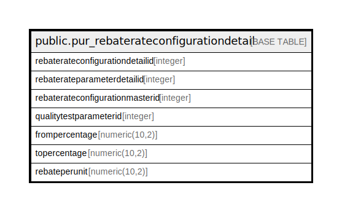

# public.pur_rebaterateconfigurationdetail

## Description

## Columns

| Name | Type | Default | Nullable | Children | Parents | Comment |
| ---- | ---- | ------- | -------- | -------- | ------- | ------- |
| rebaterateconfigurationdetailid | integer | nextval('pur_rebaterateconfigurationde_rebaterateconfigurationdetail_seq'::regclass) | false |  |  |  |
| rebaterateparameterdetailid | integer |  | true |  |  |  |
| rebaterateconfigurationmasterid | integer |  | true |  |  |  |
| qualitytestparameterid | integer |  | true |  |  |  |
| frompercentage | numeric(10,2) |  | true |  |  |  |
| topercentage | numeric(10,2) |  | true |  |  |  |
| rebateperunit | numeric(10,2) |  | true |  |  |  |

## Constraints

| Name | Type | Definition |
| ---- | ---- | ---------- |
| pur_rebaterateconfigurationdetail_pkey | PRIMARY KEY | PRIMARY KEY (rebaterateconfigurationdetailid) |

## Indexes

| Name | Definition |
| ---- | ---------- |
| pur_rebaterateconfigurationdetail_pkey | CREATE UNIQUE INDEX pur_rebaterateconfigurationdetail_pkey ON public.pur_rebaterateconfigurationdetail USING btree (rebaterateconfigurationdetailid) |

## Relations

---

> Generated by [tbls](https://github.com/k1LoW/tbls)
