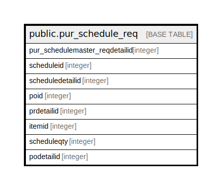

# public.pur_schedule_req

## Description

## Columns

| Name | Type | Default | Nullable | Children | Parents | Comment |
| ---- | ---- | ------- | -------- | -------- | ------- | ------- |
| pur_schedulemaster_reqdetailid | integer | nextval('pur_schedule_req_pur_schedulemaster_reqdetailid_seq'::regclass) | false |  |  |  |
| scheduleid | integer |  | true |  |  |  |
| scheduledetailid | integer |  | true |  |  |  |
| poid | integer |  | true |  |  |  |
| prdetailid | integer |  | true |  |  |  |
| itemid | integer |  | true |  |  |  |
| scheduleqty | integer |  | true |  |  |  |
| podetailid | integer |  | true |  |  |  |

## Relations

---

> Generated by [tbls](https://github.com/k1LoW/tbls)
