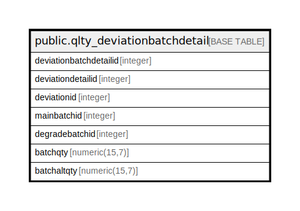

# public.qlty_deviationbatchdetail

## Description

## Columns

| Name | Type | Default | Nullable | Children | Parents | Comment |
| ---- | ---- | ------- | -------- | -------- | ------- | ------- |
| deviationbatchdetailid | integer | nextval('qlty_deviationbatchdetail_deviationbatchdetailid_seq'::regclass) | false |  |  |  |
| deviationdetailid | integer |  | true |  |  |  |
| deviationid | integer |  | true |  |  |  |
| mainbatchid | integer |  | true |  |  |  |
| degradebatchid | integer |  | true |  |  |  |
| batchqty | numeric(15,7) |  | true |  |  |  |
| batchaltqty | numeric(15,7) |  | true |  |  |  |

## Constraints

| Name | Type | Definition |
| ---- | ---- | ---------- |
| qlty_deviationbatchdetail_pkey | PRIMARY KEY | PRIMARY KEY (deviationbatchdetailid) |

## Indexes

| Name | Definition |
| ---- | ---------- |
| qlty_deviationbatchdetail_pkey | CREATE UNIQUE INDEX qlty_deviationbatchdetail_pkey ON public.qlty_deviationbatchdetail USING btree (deviationbatchdetailid) |

## Relations

---

> Generated by [tbls](https://github.com/k1LoW/tbls)
