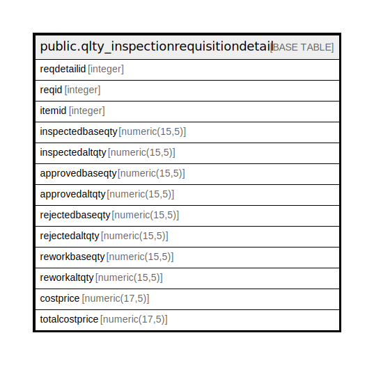

# public.qlty_inspectionrequisitiondetail

## Description

## Columns

| Name | Type | Default | Nullable | Children | Parents | Comment |
| ---- | ---- | ------- | -------- | -------- | ------- | ------- |
| reqdetailid | integer | nextval('qlty_inspectionrequisitiondetail_reqdetailid_seq'::regclass) | false |  |  |  |
| reqid | integer |  | true |  |  |  |
| itemid | integer |  | true |  |  |  |
| inspectedbaseqty | numeric(15,5) |  | true |  |  |  |
| inspectedaltqty | numeric(15,5) |  | true |  |  |  |
| approvedbaseqty | numeric(15,5) |  | true |  |  |  |
| approvedaltqty | numeric(15,5) |  | true |  |  |  |
| rejectedbaseqty | numeric(15,5) |  | true |  |  |  |
| rejectedaltqty | numeric(15,5) |  | true |  |  |  |
| reworkbaseqty | numeric(15,5) |  | true |  |  |  |
| reworkaltqty | numeric(15,5) |  | true |  |  |  |
| costprice | numeric(17,5) |  | true |  |  |  |
| totalcostprice | numeric(17,5) |  | true |  |  |  |

## Constraints

| Name | Type | Definition |
| ---- | ---- | ---------- |
| qlty_inspectionrequisitiondetail_pkey | PRIMARY KEY | PRIMARY KEY (reqdetailid) |

## Indexes

| Name | Definition |
| ---- | ---------- |
| qlty_inspectionrequisitiondetail_pkey | CREATE UNIQUE INDEX qlty_inspectionrequisitiondetail_pkey ON public.qlty_inspectionrequisitiondetail USING btree (reqdetailid) |

## Relations

---

> Generated by [tbls](https://github.com/k1LoW/tbls)
