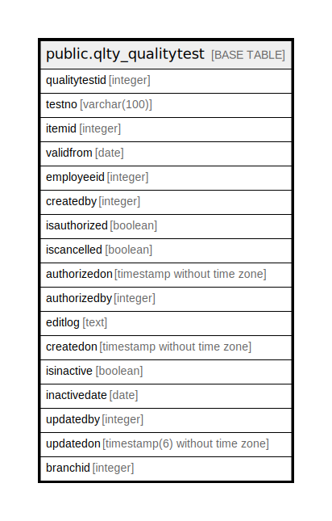

# public.qlty_qualitytest

## Description

## Columns

| Name | Type | Default | Nullable | Children | Parents | Comment |
| ---- | ---- | ------- | -------- | -------- | ------- | ------- |
| qualitytestid | integer | nextval('qlty_qualitytest_qualitytestid_seq'::regclass) | false |  |  |  |
| testno | varchar(100) |  | false |  |  |  |
| itemid | integer |  | true |  |  |  |
| validfrom | date |  | true |  |  |  |
| employeeid | integer |  | true |  |  |  |
| createdby | integer |  | true |  |  |  |
| isauthorized | boolean | false | false |  |  |  |
| iscancelled | boolean | false | false |  |  |  |
| authorizedon | timestamp without time zone |  | true |  |  |  |
| authorizedby | integer |  | true |  |  |  |
| editlog | text |  | true |  |  |  |
| createdon | timestamp without time zone | now() | true |  |  |  |
| isinactive | boolean | false | true |  |  |  |
| inactivedate | date |  | true |  |  |  |
| updatedby | integer |  | true |  |  |  |
| updatedon | timestamp(6) without time zone | NULL::timestamp without time zone | true |  |  |  |
| branchid | integer | 0 | true |  |  |  |

## Constraints

| Name | Type | Definition |
| ---- | ---- | ---------- |
| qlty_qualitytest_pkey | PRIMARY KEY | PRIMARY KEY (qualitytestid) |
| qlty_qualitytest_testno_key | UNIQUE | UNIQUE (testno) |

## Indexes

| Name | Definition |
| ---- | ---------- |
| qlty_qualitytest_pkey | CREATE UNIQUE INDEX qlty_qualitytest_pkey ON public.qlty_qualitytest USING btree (qualitytestid) |
| qlty_qualitytest_testno_key | CREATE UNIQUE INDEX qlty_qualitytest_testno_key ON public.qlty_qualitytest USING btree (testno) |

## Relations

---

> Generated by [tbls](https://github.com/k1LoW/tbls)
