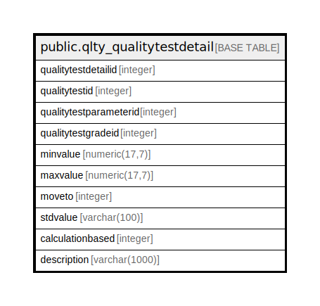

# public.qlty_qualitytestdetail

## Description

## Columns

| Name | Type | Default | Nullable | Children | Parents | Comment |
| ---- | ---- | ------- | -------- | -------- | ------- | ------- |
| qualitytestdetailid | integer | nextval('qlty_qualitytestdetail_qualitytestdetailid_seq'::regclass) | false |  |  |  |
| qualitytestid | integer |  | true |  |  |  |
| qualitytestparameterid | integer |  | true |  |  |  |
| qualitytestgradeid | integer |  | true |  |  |  |
| minvalue | numeric(17,7) |  | true |  |  |  |
| maxvalue | numeric(17,7) |  | true |  |  |  |
| moveto | integer |  | true |  |  |  |
| stdvalue | varchar(100) |  | true |  |  |  |
| calculationbased | integer | 1 | true |  |  |  |
| description | varchar(1000) | NULL::character varying | true |  |  |  |

## Constraints

| Name | Type | Definition |
| ---- | ---- | ---------- |
| qlty_qualitytestdetail_pkey | PRIMARY KEY | PRIMARY KEY (qualitytestdetailid) |

## Indexes

| Name | Definition |
| ---- | ---------- |
| qlty_qualitytestdetail_pkey | CREATE UNIQUE INDEX qlty_qualitytestdetail_pkey ON public.qlty_qualitytestdetail USING btree (qualitytestdetailid) |

## Relations

---

> Generated by [tbls](https://github.com/k1LoW/tbls)
