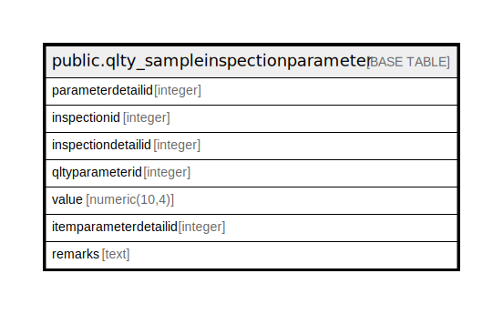

# public.qlty_sampleinspectionparameter

## Description

## Columns

| Name | Type | Default | Nullable | Children | Parents | Comment |
| ---- | ---- | ------- | -------- | -------- | ------- | ------- |
| parameterdetailid | integer | nextval('qlty_sampleinspectionparameter_parameterdetailid_seq'::regclass) | false |  |  |  |
| inspectionid | integer |  | true |  |  |  |
| inspectiondetailid | integer |  | true |  |  |  |
| qltyparameterid | integer |  | true |  |  |  |
| value | numeric(10,4) |  | true |  |  |  |
| itemparameterdetailid | integer |  | true |  |  |  |
| remarks | text |  | true |  |  |  |

## Constraints

| Name | Type | Definition |
| ---- | ---- | ---------- |
| qlty_sampleinspectionparameter_pkey | PRIMARY KEY | PRIMARY KEY (parameterdetailid) |

## Indexes

| Name | Definition |
| ---- | ---------- |
| qlty_sampleinspectionparameter_pkey | CREATE UNIQUE INDEX qlty_sampleinspectionparameter_pkey ON public.qlty_sampleinspectionparameter USING btree (parameterdetailid) |

## Relations

---

> Generated by [tbls](https://github.com/k1LoW/tbls)
