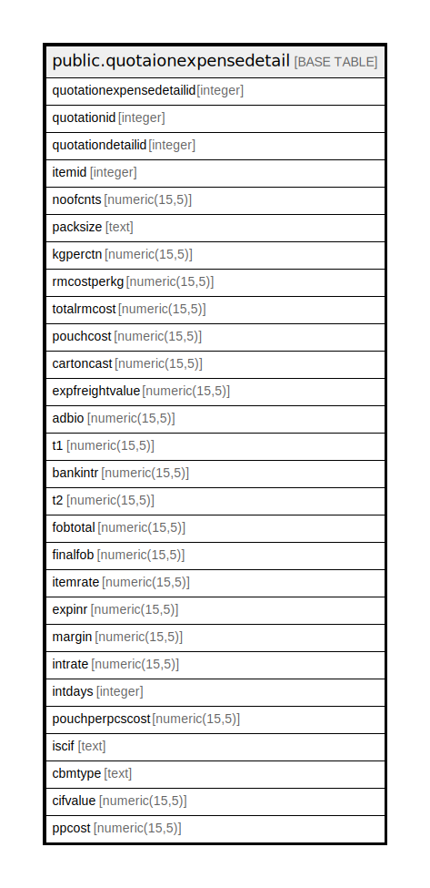

# public.quotaionexpensedetail

## Description

## Columns

| Name | Type | Default | Nullable | Children | Parents | Comment |
| ---- | ---- | ------- | -------- | -------- | ------- | ------- |
| quotationexpensedetailid | integer | nextval('quotaionexpensedetail_quotationexpensedetailid_seq'::regclass) | false |  |  |  |
| quotationid | integer |  | true |  |  |  |
| quotationdetailid | integer |  | true |  |  |  |
| itemid | integer |  | true |  |  |  |
| noofcnts | numeric(15,5) |  | true |  |  |  |
| packsize | text |  | true |  |  |  |
| kgperctn | numeric(15,5) |  | true |  |  |  |
| rmcostperkg | numeric(15,5) |  | true |  |  |  |
| totalrmcost | numeric(15,5) |  | true |  |  |  |
| pouchcost | numeric(15,5) |  | true |  |  |  |
| cartoncast | numeric(15,5) |  | true |  |  |  |
| expfreightvalue | numeric(15,5) |  | true |  |  |  |
| adbio | numeric(15,5) |  | true |  |  |  |
| t1 | numeric(15,5) |  | true |  |  |  |
| bankintr | numeric(15,5) |  | true |  |  |  |
| t2 | numeric(15,5) |  | true |  |  |  |
| fobtotal | numeric(15,5) |  | true |  |  |  |
| finalfob | numeric(15,5) |  | true |  |  |  |
| itemrate | numeric(15,5) |  | true |  |  |  |
| expinr | numeric(15,5) |  | true |  |  |  |
| margin | numeric(15,5) |  | true |  |  |  |
| intrate | numeric(15,5) |  | true |  |  |  |
| intdays | integer |  | true |  |  |  |
| pouchperpcscost | numeric(15,5) |  | true |  |  |  |
| iscif | text |  | true |  |  |  |
| cbmtype | text |  | true |  |  |  |
| cifvalue | numeric(15,5) |  | true |  |  |  |
| ppcost | numeric(15,5) |  | true |  |  |  |

## Constraints

| Name | Type | Definition |
| ---- | ---- | ---------- |
| quotaionexpensedetail_pkey | PRIMARY KEY | PRIMARY KEY (quotationexpensedetailid) |

## Indexes

| Name | Definition |
| ---- | ---------- |
| quotaionexpensedetail_pkey | CREATE UNIQUE INDEX quotaionexpensedetail_pkey ON public.quotaionexpensedetail USING btree (quotationexpensedetailid) |

## Relations

---

> Generated by [tbls](https://github.com/k1LoW/tbls)
