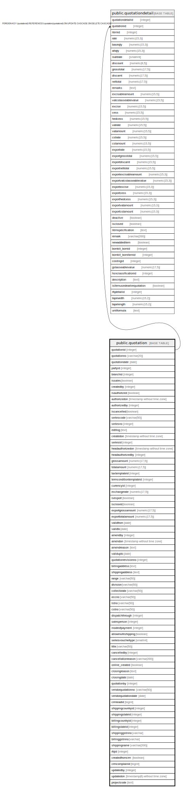

# public.quotation

## Description

## Columns

| Name | Type | Default | Nullable | Children | Parents | Comment |
| ---- | ---- | ------- | -------- | -------- | ------- | ------- |
| quotationid | integer | nextval('quotation_quotationid_seq'::regclass) | false | [public.quotationdetail](public.quotationdetail.md) |  |  |
| quotationno | varchar(20) |  | true |  |  |  |
| quotationdate | date |  | true |  |  |  |
| partyid | integer |  | true |  |  |  |
| branchid | integer |  | true |  |  |  |
| issales | boolean | true | false |  |  |  |
| createdby | integer |  | true |  |  |  |
| isauthorized | boolean | false | false |  |  |  |
| authorizedon | timestamp without time zone |  | true |  |  |  |
| authorizedby | integer |  | true |  |  |  |
| iscancelled | boolean | false | false |  |  |  |
| seriescode | varchar(50) |  | true |  |  |  |
| seriesno | integer |  | true |  |  |  |
| editlog | text |  | true |  |  |  |
| createdon | timestamp without time zone | now() | true |  |  |  |
| seriesid | integer |  | true |  |  |  |
| headauthorizedon | timestamp without time zone |  | true |  |  |  |
| headauthorizedby | integer |  | true |  |  |  |
| grossamount | numeric(17,5) |  | true |  |  |  |
| totalamount | numeric(17,5) |  | true |  |  |  |
| taxtemplateid | integer |  | true |  |  |  |
| termconditiontemplateid | integer |  | true |  |  |  |
| currencyid | integer |  | true |  |  |  |
| exchangerate | numeric(17,5) |  | true |  |  |  |
| isexport | boolean | false | true |  |  |  |
| isclosed | boolean | false | true |  |  |  |
| exportgrossamount | numeric(17,5) |  | true |  |  |  |
| exporttotalamount | numeric(17,5) |  | true |  |  |  |
| validfrom | date |  | true |  |  |  |
| validto | date |  | true |  |  |  |
| amendby | integer |  | true |  |  |  |
| amendon | timestamp without time zone |  | true |  |  |  |
| amendreason | text |  | true |  |  |  |
| validupto | date |  | true |  |  |  |
| quotationrevisionno | integer |  | true |  |  |  |
| billingaddress | text |  | true |  |  |  |
| shippingaddress | text |  | true |  |  |  |
| range | varchar(50) |  | true |  |  |  |
| division | varchar(50) |  | true |  |  |  |
| collectorate | varchar(50) |  | true |  |  |  |
| eccno | varchar(50) |  | true |  |  |  |
| lstno | varchar(50) |  | true |  |  |  |
| cstno | varchar(50) |  | true |  |  |  |
| dispatchthrough | integer |  | true |  |  |  |
| salesperson | integer |  | true |  |  |  |
| modeofpayment | integer |  | true |  |  |  |
| allowmultishipping | boolean | false | true |  |  |  |
| seriesvouchertype | smallint |  | true |  |  |  |
| title | varchar(50) |  | true |  |  |  |
| cancelledby | integer |  | true |  |  |  |
| cancellationreason | varchar(200) |  | true |  |  |  |
| online_created | boolean | false | true |  |  |  |
| closingreason | text |  | true |  |  |  |
| closingdate | date |  | true |  |  |  |
| quotationby | integer |  | true |  |  |  |
| vendorquotationno | varchar(50) |  | true |  |  |  |
| vendorquotationdate | date |  | true |  |  |  |
| crmleadid | bigint |  | true |  |  |  |
| shippingcountryid | integer |  | true |  |  |  |
| shippingstateid | integer |  | true |  |  |  |
| billingcountryid | integer |  | true |  |  |  |
| billingstateid | integer |  | true |  |  |  |
| shippinggstinno | varchar |  | true |  |  |  |
| billinggstinno | varchar |  | true |  |  |  |
| shippingname | varchar(200) |  | true |  |  |  |
| rfqid | integer |  | true |  |  |  |
| createdfromcrm | boolean | false | true |  |  |  |
| crmcomplainid | bigint |  | true |  |  |  |
| updatedby | integer |  | true |  |  |  |
| updatedon | timestamp(6) without time zone | NULL::timestamp without time zone | true |  |  |  |
| projectcode | text |  | true |  |  |  |

## Constraints

| Name | Type | Definition |
| ---- | ---- | ---------- |
| purchasequotation_pkey | PRIMARY KEY | PRIMARY KEY (quotationid) |

## Indexes

| Name | Definition |
| ---- | ---------- |
| purchasequotation_pkey | CREATE UNIQUE INDEX purchasequotation_pkey ON public.quotation USING btree (quotationid) |
| ui_quotation_no | CREATE UNIQUE INDEX ui_quotation_no ON public.quotation USING btree (branchid, quotationdate, quotationno) WHERE (quotationid > 0) |

## Triggers

| Name | Definition |
| ---- | ---------- |
| quotation_amendlog_entry | CREATE TRIGGER quotation_amendlog_entry BEFORE UPDATE ON public.quotation FOR EACH ROW EXECUTE FUNCTION quotation_amendlog_entry() |

## Relations

---

> Generated by [tbls](https://github.com/k1LoW/tbls)
