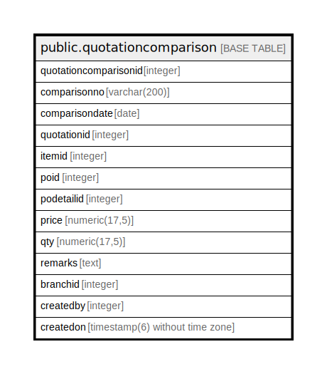

# public.quotationcomparison

## Description

## Columns

| Name | Type | Default | Nullable | Children | Parents | Comment |
| ---- | ---- | ------- | -------- | -------- | ------- | ------- |
| quotationcomparisonid | integer | nextval('quotationcomparison_quotationcomparisonid_seq'::regclass) | false |  |  |  |
| comparisonno | varchar(200) |  | true |  |  |  |
| comparisondate | date |  | true |  |  |  |
| quotationid | integer |  | true |  |  |  |
| itemid | integer |  | true |  |  |  |
| poid | integer |  | true |  |  |  |
| podetailid | integer |  | true |  |  |  |
| price | numeric(17,5) |  | true |  |  |  |
| qty | numeric(17,5) |  | true |  |  |  |
| remarks | text |  | true |  |  |  |
| branchid | integer |  | true |  |  |  |
| createdby | integer |  | true |  |  |  |
| createdon | timestamp(6) without time zone | now() | true |  |  |  |

## Constraints

| Name | Type | Definition |
| ---- | ---- | ---------- |
| quotationcomparison_pkey | PRIMARY KEY | PRIMARY KEY (quotationcomparisonid) |

## Indexes

| Name | Definition |
| ---- | ---------- |
| quotationcomparison_pkey | CREATE UNIQUE INDEX quotationcomparison_pkey ON public.quotationcomparison USING btree (quotationcomparisonid) |

## Relations

---

> Generated by [tbls](https://github.com/k1LoW/tbls)
