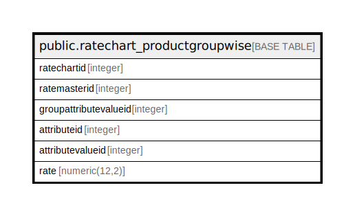

# public.ratechart_productgroupwise

## Description

## Columns

| Name | Type | Default | Nullable | Children | Parents | Comment |
| ---- | ---- | ------- | -------- | -------- | ------- | ------- |
| ratechartid | integer | nextval('ratechart_productgroupwise_ratechartid_seq'::regclass) | false |  |  |  |
| ratemasterid | integer |  | true |  |  |  |
| groupattributevalueid | integer |  | true |  |  |  |
| attributeid | integer |  | true |  |  |  |
| attributevalueid | integer |  | true |  |  |  |
| rate | numeric(12,2) |  | true |  |  |  |

## Constraints

| Name | Type | Definition |
| ---- | ---- | ---------- |
| ratechart_productgroupwise_pkey | PRIMARY KEY | PRIMARY KEY (ratechartid) |

## Indexes

| Name | Definition |
| ---- | ---------- |
| ratechart_productgroupwise_pkey | CREATE UNIQUE INDEX ratechart_productgroupwise_pkey ON public.ratechart_productgroupwise USING btree (ratechartid) |

## Relations

---

> Generated by [tbls](https://github.com/k1LoW/tbls)
