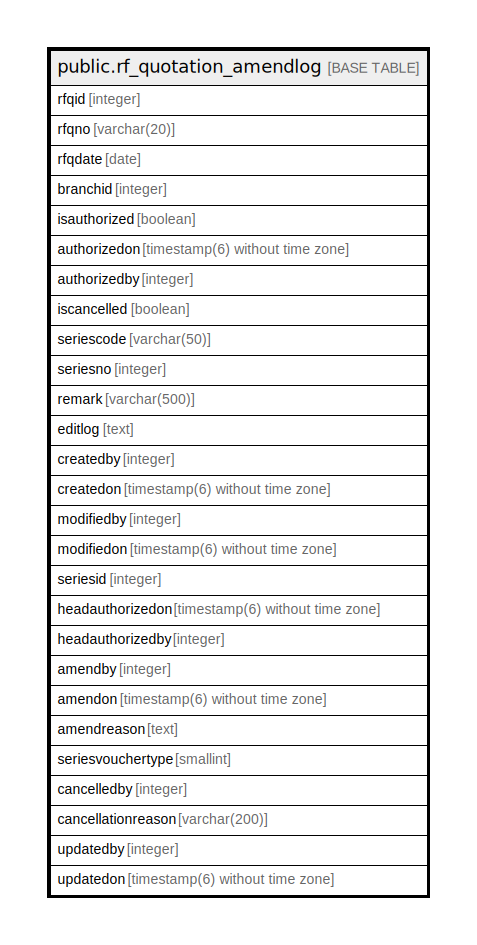

# public.rf_quotation_amendlog

## Description

## Columns

| Name | Type | Default | Nullable | Children | Parents | Comment |
| ---- | ---- | ------- | -------- | -------- | ------- | ------- |
| rfqid | integer |  | true |  |  |  |
| rfqno | varchar(20) |  | true |  |  |  |
| rfqdate | date |  | true |  |  |  |
| branchid | integer |  | true |  |  |  |
| isauthorized | boolean | false | false |  |  |  |
| authorizedon | timestamp(6) without time zone |  | true |  |  |  |
| authorizedby | integer |  | true |  |  |  |
| iscancelled | boolean | false | false |  |  |  |
| seriescode | varchar(50) |  | true |  |  |  |
| seriesno | integer |  | true |  |  |  |
| remark | varchar(500) |  | true |  |  |  |
| editlog | text |  | true |  |  |  |
| createdby | integer |  | true |  |  |  |
| createdon | timestamp(6) without time zone | now() | true |  |  |  |
| modifiedby | integer |  | true |  |  |  |
| modifiedon | timestamp(6) without time zone |  | true |  |  |  |
| seriesid | integer |  | true |  |  |  |
| headauthorizedon | timestamp(6) without time zone |  | true |  |  |  |
| headauthorizedby | integer |  | true |  |  |  |
| amendby | integer |  | true |  |  |  |
| amendon | timestamp(6) without time zone |  | true |  |  |  |
| amendreason | text |  | true |  |  |  |
| seriesvouchertype | smallint |  | true |  |  |  |
| cancelledby | integer |  | true |  |  |  |
| cancellationreason | varchar(200) |  | true |  |  |  |
| updatedby | integer |  | true |  |  |  |
| updatedon | timestamp(6) without time zone | NULL::timestamp without time zone | true |  |  |  |

## Relations

---

> Generated by [tbls](https://github.com/k1LoW/tbls)
