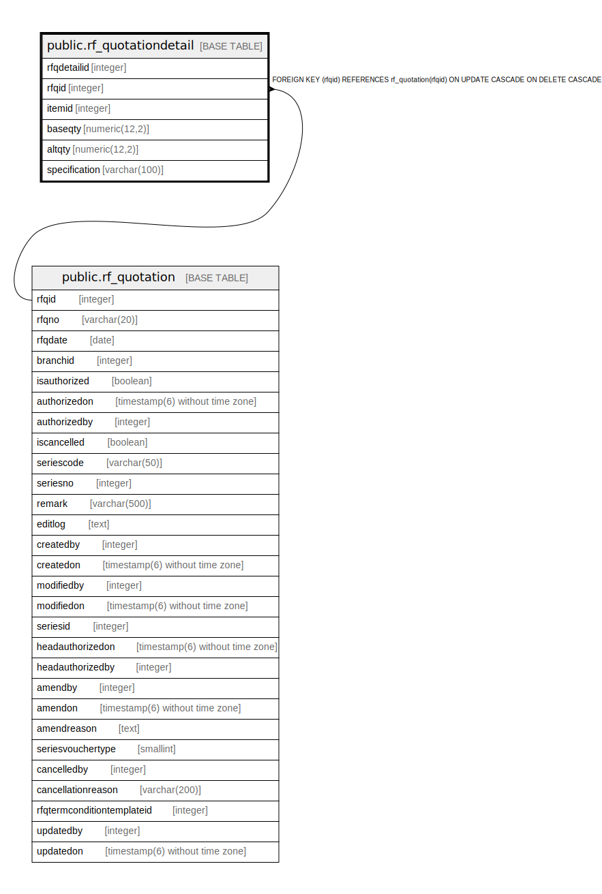

# public.rf_quotationdetail

## Description

## Columns

| Name | Type | Default | Nullable | Children | Parents | Comment |
| ---- | ---- | ------- | -------- | -------- | ------- | ------- |
| rfqdetailid | integer | nextval('rf_quotationdetail_rfqdetailid_seq'::regclass) | false |  |  |  |
| rfqid | integer |  | true |  | [public.rf_quotation](public.rf_quotation.md) |  |
| itemid | integer |  | true |  |  |  |
| baseqty | numeric(12,2) |  | true |  |  |  |
| altqty | numeric(12,2) |  | true |  |  |  |
| specification | varchar(100) |  | true |  |  |  |

## Constraints

| Name | Type | Definition |
| ---- | ---- | ---------- |
| rf_quotationdetail_fk | FOREIGN KEY | FOREIGN KEY (rfqid) REFERENCES rf_quotation(rfqid) ON UPDATE CASCADE ON DELETE CASCADE |
| rf_quotationdetail_pkey | PRIMARY KEY | PRIMARY KEY (rfqdetailid) |

## Indexes

| Name | Definition |
| ---- | ---------- |
| rf_quotationdetail_pkey | CREATE UNIQUE INDEX rf_quotationdetail_pkey ON public.rf_quotationdetail USING btree (rfqdetailid) |

## Relations

---

> Generated by [tbls](https://github.com/k1LoW/tbls)
