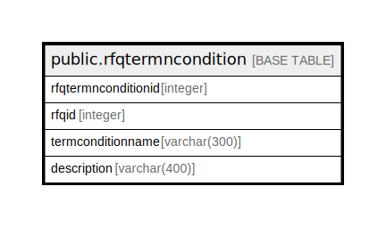

# public.rfqtermncondition

## Description

## Columns

| Name | Type | Default | Nullable | Children | Parents | Comment |
| ---- | ---- | ------- | -------- | -------- | ------- | ------- |
| rfqtermnconditionid | integer | nextval('rfqtermncondition_rfqtermnconditionid_seq'::regclass) | false |  |  |  |
| rfqid | integer |  | true |  |  |  |
| termconditionname | varchar(300) |  | true |  |  |  |
| description | varchar(400) |  | true |  |  |  |

## Constraints

| Name | Type | Definition |
| ---- | ---- | ---------- |
| rfqtermncondition_pkey | PRIMARY KEY | PRIMARY KEY (rfqtermnconditionid) |

## Indexes

| Name | Definition |
| ---- | ---------- |
| rfqtermncondition_pkey | CREATE UNIQUE INDEX rfqtermncondition_pkey ON public.rfqtermncondition USING btree (rfqtermnconditionid) |

## Relations

---

> Generated by [tbls](https://github.com/k1LoW/tbls)
