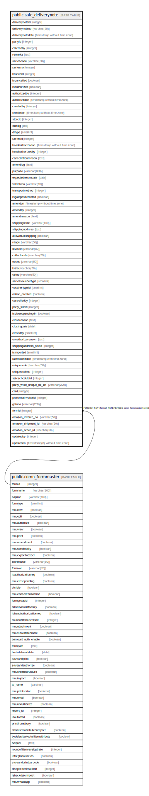

# public.sale_deliverynote

## Description

## Columns

| Name | Type | Default | Nullable | Children | Parents | Comment |
| ---- | ---- | ------- | -------- | -------- | ------- | ------- |
| deliverynoteid | integer | nextval('sale_deliverynote_deliverynoteid_seq'::regclass) | false |  |  |  |
| deliverynoteno | varchar(50) |  | true |  |  |  |
| deliverynotedate | timestamp without time zone |  | true |  |  |  |
| partyid | integer |  | true |  |  |  |
| enteredby | integer |  | true |  |  |  |
| remarks | text |  | true |  |  |  |
| seriescode | varchar(50) |  | true |  |  |  |
| seriesno | integer |  | true |  |  |  |
| branchid | integer |  | true |  |  |  |
| iscancelled | boolean | false | false |  |  |  |
| isauthorized | boolean | false | false |  |  |  |
| authorizedby | integer |  | true |  |  |  |
| authorizedon | timestamp without time zone |  | true |  |  |  |
| createdby | integer |  | true |  |  |  |
| createdon | timestamp without time zone | now() | false |  |  |  |
| storeid | integer |  | true |  |  |  |
| editlog | text |  | true |  |  |  |
| dltype | smallint | 0 | false |  |  | 0 : Delivery Note 1 : Sample Delivery Note 2 : Rejection Return 3 : Work Order Deliverynote 4 : Rgp 5 : NRGP 6 : Scrap 7 : Delivery Note Without SO 8 : Trading Delivery Note 9 : RGP Insource 10 : Free Replacement |
| seriesid | integer |  | true |  |  |  |
| headauthorizedon | timestamp without time zone |  | true |  |  |  |
| headauthorizedby | integer |  | true |  |  |  |
| cancellationreason | text |  | true |  |  |  |
| amendlog | text |  | true |  |  |  |
| purpose | varchar(800) |  | true |  |  |  |
| expectedreturndate | date |  | true |  |  |  |
| vehicleno | varchar(15) |  | true |  |  |  |
| transportmethod | integer | 0 | false |  |  |  |
| isgatepasscreated | boolean | false | true |  |  |  |
| amendon | timestamp without time zone |  | true |  |  |  |
| amendby | integer |  | true |  |  |  |
| amendreason | text |  | true |  |  |  |
| shippingname | varchar(100) |  | true |  |  |  |
| shippingaddress | text |  | true |  |  |  |
| allowmultishipping | boolean | false | true |  |  |  |
| range | varchar(50) |  | true |  |  |  |
| division | varchar(50) |  | true |  |  |  |
| collectorate | varchar(50) |  | true |  |  |  |
| eccno | varchar(50) |  | true |  |  |  |
| lstno | varchar(50) |  | true |  |  |  |
| cstno | varchar(50) |  | true |  |  |  |
| seriesvouchertype | smallint |  | true |  |  |  |
| vouchertypeid | smallint |  | true |  |  |  |
| online_created | boolean | false | true |  |  |  |
| cancelledby | integer |  | true |  |  |  |
| party_siteid | integer |  | true |  |  |  |
| isclosedpendingdn | boolean | false | true |  |  |  |
| closereason | text |  | true |  |  |  |
| closingdate | date |  | true |  |  |  |
| closedby | smallint |  | true |  |  |  |
| unauthorizereason | text |  | true |  |  |  |
| shippingaddress_siteid | integer |  | true |  |  |  |
| isimported | smallint | 0 | true |  |  | 0 -> Normal DLN 1 -> Imported From Excel[Data Wind] 2 -> Imported From Webportal [Data Wind] |
| lastmodifiedon | timestamp with time zone | now() | true |  |  |  |
| uniquecode | varchar(50) |  | true |  |  |  |
| uniquecodeno | integer |  | true |  |  |  |
| salescheduleid | integer |  | true |  |  |  |
| party_wise_unique_no_dn | varchar(200) | ''::character varying | false |  |  |  |
| cnid | integer |  | true |  |  |  |
| proformainvoiceid | integer |  | true |  |  |  |
| gstnno | varchar(255) |  | true |  |  |  |
| formid | integer | 66 | false |  | [public.comn_formmaster](public.comn_formmaster.md) |  |
| amazon_invoice_no | varchar(50) | ''::character varying | true |  |  |  |
| amazon_shipment_id | varchar(50) | ''::character varying | true |  |  |  |
| amazon_order_id | varchar(50) |  | true |  |  |  |
| updatedby | integer |  | true |  |  |  |
| updatedon | timestamp(6) without time zone | NULL::timestamp without time zone | true |  |  |  |

## Constraints

| Name | Type | Definition |
| ---- | ---- | ---------- |
| sale_deliverynote_formid_fkey | FOREIGN KEY | FOREIGN KEY (formid) REFERENCES comn_formmaster(formid) |
| sale_deliverynote_pkey | PRIMARY KEY | PRIMARY KEY (deliverynoteid) |
| ucdl | UNIQUE | UNIQUE (uniquecode) |
| ucndl | UNIQUE | UNIQUE (uniquecodeno) |

## Indexes

| Name | Definition |
| ---- | ---------- |
| sale_deliverynote_pkey | CREATE UNIQUE INDEX sale_deliverynote_pkey ON public.sale_deliverynote USING btree (deliverynoteid) |
| ucdl | CREATE UNIQUE INDEX ucdl ON public.sale_deliverynote USING btree (uniquecode) |
| ucndl | CREATE UNIQUE INDEX ucndl ON public.sale_deliverynote USING btree (uniquecodeno) |
| Index_DN_DNidCanc | CREATE INDEX "Index_DN_DNidCanc" ON public.sale_deliverynote USING btree (deliverynoteid) WHERE (iscancelled = false) |
| deliverynote_all | CREATE INDEX deliverynote_all ON public.sale_deliverynote USING btree (deliverynoteid, storeid, branchid) |
| deliverynote_branchid | CREATE INDEX deliverynote_branchid ON public.sale_deliverynote USING btree (branchid) |
| deliverynote_deliverynoteid | CREATE INDEX deliverynote_deliverynoteid ON public.sale_deliverynote USING btree (deliverynoteid) |
| deliverynote_storeid | CREATE INDEX deliverynote_storeid ON public.sale_deliverynote USING btree (storeid) |
| ui_deliverynote_no | CREATE UNIQUE INDEX ui_deliverynote_no ON public.sale_deliverynote USING btree (branchid, dltype, ((deliverynotedate)::date), deliverynoteno) WHERE (deliverynoteid > 0) |

## Triggers

| Name | Definition |
| ---- | ---------- |
| deliverynote_amendlog_entry | CREATE TRIGGER deliverynote_amendlog_entry BEFORE UPDATE ON public.sale_deliverynote FOR EACH ROW EXECUTE FUNCTION deliverynote_amendlog_entry() |
| tgr_updatecostdate_delnote | CREATE TRIGGER tgr_updatecostdate_delnote AFTER INSERT OR UPDATE ON public.sale_deliverynote FOR EACH ROW EXECUTE FUNCTION tgr_updatecostdate() |

## Relations

---

> Generated by [tbls](https://github.com/k1LoW/tbls)
