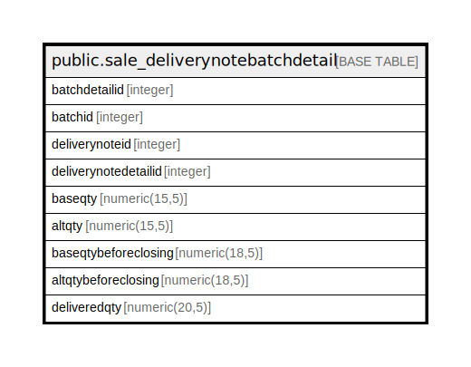

# public.sale_deliverynotebatchdetail

## Description

## Columns

| Name | Type | Default | Nullable | Children | Parents | Comment |
| ---- | ---- | ------- | -------- | -------- | ------- | ------- |
| batchdetailid | integer | nextval('sale_deliverynotebatchdetail_batchdetailid_seq'::regclass) | false |  |  |  |
| batchid | integer |  | true |  |  |  |
| deliverynoteid | integer |  | true |  |  |  |
| deliverynotedetailid | integer |  | true |  |  |  |
| baseqty | numeric(15,5) |  | true |  |  |  |
| altqty | numeric(15,5) |  | true |  |  |  |
| baseqtybeforeclosing | numeric(18,5) | 0 | true |  |  |  |
| altqtybeforeclosing | numeric(18,5) | 0 | true |  |  |  |
| deliveredqty | numeric(20,5) |  | true |  |  |  |

## Constraints

| Name | Type | Definition |
| ---- | ---- | ---------- |
| sale_deliverynotebatchdetail_pkey | PRIMARY KEY | PRIMARY KEY (batchdetailid) |

## Indexes

| Name | Definition |
| ---- | ---------- |
| sale_deliverynotebatchdetail_pkey | CREATE UNIQUE INDEX sale_deliverynotebatchdetail_pkey ON public.sale_deliverynotebatchdetail USING btree (batchdetailid) |
| Index_DN_BatDet_DNIDDetID | CREATE INDEX "Index_DN_BatDet_DNIDDetID" ON public.sale_deliverynotebatchdetail USING btree (deliverynoteid, deliverynotedetailid) |
| Index_DN_BatDet_DetID | CREATE INDEX "Index_DN_BatDet_DetID" ON public.sale_deliverynotebatchdetail USING btree (deliverynotedetailid) |
| deliverynotebatch_batchid | CREATE INDEX deliverynotebatch_batchid ON public.sale_deliverynotebatchdetail USING btree (batchid) |
| deliverynotebatch_deliverynotedetailid | CREATE INDEX deliverynotebatch_deliverynotedetailid ON public.sale_deliverynotebatchdetail USING btree (deliverynotedetailid) |

## Triggers

| Name | Definition |
| ---- | ---------- |
| deliverynotebatchdetail_trg_checkstock | CREATE TRIGGER deliverynotebatchdetail_trg_checkstock BEFORE INSERT OR UPDATE ON public.sale_deliverynotebatchdetail FOR EACH ROW EXECUTE FUNCTION trg_checkstock() |

## Relations

---

> Generated by [tbls](https://github.com/k1LoW/tbls)
