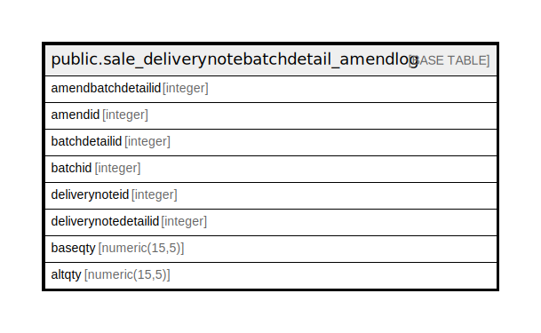

# public.sale_deliverynotebatchdetail_amendlog

## Description

## Columns

| Name | Type | Default | Nullable | Children | Parents | Comment |
| ---- | ---- | ------- | -------- | -------- | ------- | ------- |
| amendbatchdetailid | integer | nextval('sale_deliverynotebatchdetail_amendlog_amendbatchdetailid_seq'::regclass) | false |  |  |  |
| amendid | integer |  | true |  |  |  |
| batchdetailid | integer |  | true |  |  |  |
| batchid | integer |  | true |  |  |  |
| deliverynoteid | integer |  | true |  |  |  |
| deliverynotedetailid | integer |  | true |  |  |  |
| baseqty | numeric(15,5) |  | true |  |  |  |
| altqty | numeric(15,5) |  | true |  |  |  |

## Constraints

| Name | Type | Definition |
| ---- | ---- | ---------- |
| sale_deliverynotebatchdetail_amendlog_pkey | PRIMARY KEY | PRIMARY KEY (amendbatchdetailid) |

## Indexes

| Name | Definition |
| ---- | ---------- |
| sale_deliverynotebatchdetail_amendlog_pkey | CREATE UNIQUE INDEX sale_deliverynotebatchdetail_amendlog_pkey ON public.sale_deliverynotebatchdetail_amendlog USING btree (amendbatchdetailid) |

## Relations

---

> Generated by [tbls](https://github.com/k1LoW/tbls)
