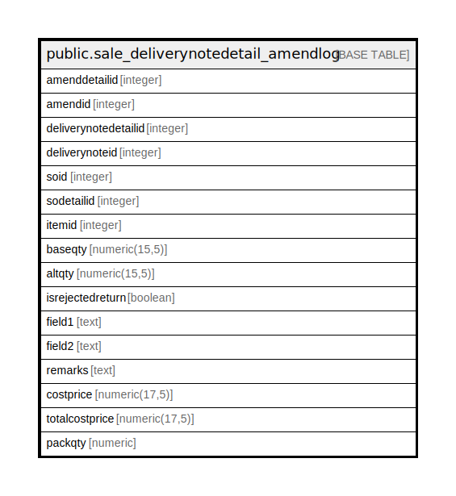

# public.sale_deliverynotedetail_amendlog

## Description

## Columns

| Name | Type | Default | Nullable | Children | Parents | Comment |
| ---- | ---- | ------- | -------- | -------- | ------- | ------- |
| amenddetailid | integer | nextval('sale_deliverynotedetail_amendlog_amenddetailid_seq'::regclass) | false |  |  |  |
| amendid | integer |  | true |  |  |  |
| deliverynotedetailid | integer |  | true |  |  |  |
| deliverynoteid | integer |  | true |  |  |  |
| soid | integer |  | true |  |  |  |
| sodetailid | integer |  | true |  |  |  |
| itemid | integer |  | true |  |  |  |
| baseqty | numeric(15,5) |  | true |  |  |  |
| altqty | numeric(15,5) |  | true |  |  |  |
| isrejectedreturn | boolean | false | true |  |  |  |
| field1 | text |  | true |  |  |  |
| field2 | text |  | true |  |  |  |
| remarks | text |  | true |  |  |  |
| costprice | numeric(17,5) | 0 | true |  |  |  |
| totalcostprice | numeric(17,5) | 0 | true |  |  |  |
| packqty | numeric | 0 | true |  |  |  |

## Constraints

| Name | Type | Definition |
| ---- | ---- | ---------- |
| sale_deliverynotedetail_amendlog_pkey | PRIMARY KEY | PRIMARY KEY (amenddetailid) |

## Indexes

| Name | Definition |
| ---- | ---------- |
| sale_deliverynotedetail_amendlog_pkey | CREATE UNIQUE INDEX sale_deliverynotedetail_amendlog_pkey ON public.sale_deliverynotedetail_amendlog USING btree (amenddetailid) |

## Relations

---

> Generated by [tbls](https://github.com/k1LoW/tbls)
