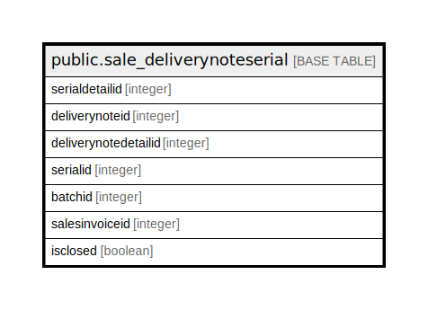

# public.sale_deliverynoteserial

## Description

## Columns

| Name | Type | Default | Nullable | Children | Parents | Comment |
| ---- | ---- | ------- | -------- | -------- | ------- | ------- |
| serialdetailid | integer | nextval('sale_deliverynoteserial_serialdetailid_seq'::regclass) | false |  |  |  |
| deliverynoteid | integer |  | true |  |  |  |
| deliverynotedetailid | integer |  | true |  |  |  |
| serialid | integer |  | true |  |  |  |
| batchid | integer |  | true |  |  |  |
| salesinvoiceid | integer |  | true |  |  |  |
| isclosed | boolean | false | true |  |  |  |

## Constraints

| Name | Type | Definition |
| ---- | ---- | ---------- |
| sale_deliverynoteserial_pkey | PRIMARY KEY | PRIMARY KEY (serialdetailid) |

## Indexes

| Name | Definition |
| ---- | ---------- |
| sale_deliverynoteserial_pkey | CREATE UNIQUE INDEX sale_deliverynoteserial_pkey ON public.sale_deliverynoteserial USING btree (serialdetailid) |
| Index_DN_SerDet_DNIDDetID | CREATE INDEX "Index_DN_SerDet_DNIDDetID" ON public.sale_deliverynoteserial USING btree (deliverynoteid, deliverynotedetailid) |
| Index_DN_SerDet_DetID | CREATE INDEX "Index_DN_SerDet_DetID" ON public.sale_deliverynoteserial USING btree (deliverynotedetailid) |
| deliverynoteserial_deliverynoteid | CREATE INDEX deliverynoteserial_deliverynoteid ON public.sale_deliverynoteserial USING btree (deliverynoteid) |
| deliverynoteserial_serial | CREATE INDEX deliverynoteserial_serial ON public.sale_deliverynoteserial USING btree (serialid, deliverynoteid) |
| deliverynoteserial_serialdetailid | CREATE INDEX deliverynoteserial_serialdetailid ON public.sale_deliverynoteserial USING btree (serialdetailid) |
| deliverynoteserial_serialid | CREATE INDEX deliverynoteserial_serialid ON public.sale_deliverynoteserial USING btree (serialid) |

## Triggers

| Name | Definition |
| ---- | ---------- |
| insert_deliveredserial_trg_check | CREATE TRIGGER insert_deliveredserial_trg_check BEFORE INSERT ON public.sale_deliverynoteserial FOR EACH ROW EXECUTE FUNCTION trg_checkstock() |
| serialhistorydata | CREATE TRIGGER serialhistorydata BEFORE INSERT ON public.sale_deliverynoteserial FOR EACH ROW EXECUTE FUNCTION tgr_serialhistory() |
| update_deliveredserial_trg_check | CREATE TRIGGER update_deliveredserial_trg_check BEFORE UPDATE ON public.sale_deliverynoteserial FOR EACH ROW EXECUTE FUNCTION trg_checkstock() |

## Relations

---

> Generated by [tbls](https://github.com/k1LoW/tbls)
