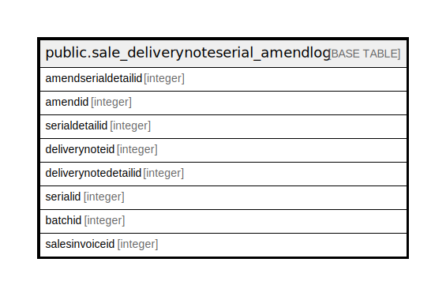

# public.sale_deliverynoteserial_amendlog

## Description

## Columns

| Name | Type | Default | Nullable | Children | Parents | Comment |
| ---- | ---- | ------- | -------- | -------- | ------- | ------- |
| amendserialdetailid | integer | nextval('sale_deliverynoteserial_amendlog_amendserialdetailid_seq'::regclass) | false |  |  |  |
| amendid | integer |  | true |  |  |  |
| serialdetailid | integer |  | true |  |  |  |
| deliverynoteid | integer |  | true |  |  |  |
| deliverynotedetailid | integer |  | true |  |  |  |
| serialid | integer |  | true |  |  |  |
| batchid | integer |  | true |  |  |  |
| salesinvoiceid | integer |  | true |  |  |  |

## Constraints

| Name | Type | Definition |
| ---- | ---- | ---------- |
| sale_deliverynoteserial_amendlog_pkey | PRIMARY KEY | PRIMARY KEY (amendserialdetailid) |

## Indexes

| Name | Definition |
| ---- | ---------- |
| sale_deliverynoteserial_amendlog_pkey | CREATE UNIQUE INDEX sale_deliverynoteserial_amendlog_pkey ON public.sale_deliverynoteserial_amendlog USING btree (amendserialdetailid) |

## Relations

---

> Generated by [tbls](https://github.com/k1LoW/tbls)
