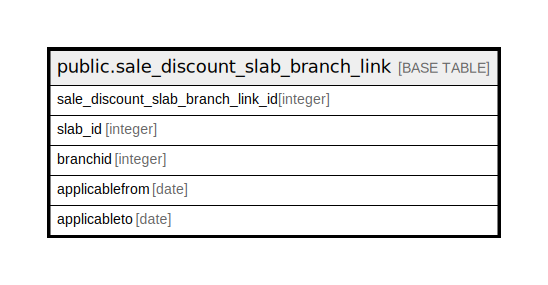

# public.sale_discount_slab_branch_link

## Description

## Columns

| Name | Type | Default | Nullable | Children | Parents | Comment |
| ---- | ---- | ------- | -------- | -------- | ------- | ------- |
| sale_discount_slab_branch_link_id | integer | nextval('sale_discount_slab_branch_lin_sale_discount_slab_branch_lin_seq'::regclass) | false |  |  |  |
| slab_id | integer |  | true |  |  |  |
| branchid | integer |  | true |  |  |  |
| applicablefrom | date |  | true |  |  |  |
| applicableto | date |  | true |  |  |  |

## Constraints

| Name | Type | Definition |
| ---- | ---- | ---------- |
| sale_discount_slab_branch_link_pkey | PRIMARY KEY | PRIMARY KEY (sale_discount_slab_branch_link_id) |

## Indexes

| Name | Definition |
| ---- | ---------- |
| sale_discount_slab_branch_link_pkey | CREATE UNIQUE INDEX sale_discount_slab_branch_link_pkey ON public.sale_discount_slab_branch_link USING btree (sale_discount_slab_branch_link_id) |

## Relations

---

> Generated by [tbls](https://github.com/k1LoW/tbls)
