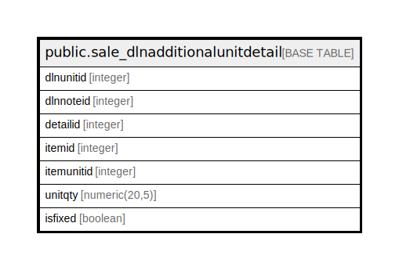

# public.sale_dlnadditionalunitdetail

## Description

## Columns

| Name | Type | Default | Nullable | Children | Parents | Comment |
| ---- | ---- | ------- | -------- | -------- | ------- | ------- |
| dlnunitid | integer | nextval('sale_dlnadditionalunitdetail_dlnunitid_seq'::regclass) | false |  |  |  |
| dlnnoteid | integer |  | true |  |  |  |
| detailid | integer |  | true |  |  |  |
| itemid | integer |  | true |  |  |  |
| itemunitid | integer |  | true |  |  |  |
| unitqty | numeric(20,5) |  | true |  |  |  |
| isfixed | boolean | false | true |  |  |  |

## Constraints

| Name | Type | Definition |
| ---- | ---- | ---------- |
| sale_dlnadditionalunitdetail_pkey | PRIMARY KEY | PRIMARY KEY (dlnunitid) |

## Indexes

| Name | Definition |
| ---- | ---------- |
| sale_dlnadditionalunitdetail_pkey | CREATE UNIQUE INDEX sale_dlnadditionalunitdetail_pkey ON public.sale_dlnadditionalunitdetail USING btree (dlnunitid) |

## Relations

---

> Generated by [tbls](https://github.com/k1LoW/tbls)
