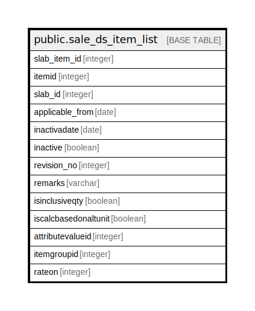

# public.sale_ds_item_list

## Description

## Columns

| Name | Type | Default | Nullable | Children | Parents | Comment |
| ---- | ---- | ------- | -------- | -------- | ------- | ------- |
| slab_item_id | integer | nextval('sale_ds_item_list_slab_item_id_seq'::regclass) | false |  |  |  |
| itemid | integer |  | true |  |  |  |
| slab_id | integer |  | true |  |  |  |
| applicable_from | date |  | true |  |  |  |
| inactivadate | date |  | true |  |  |  |
| inactive | boolean |  | true |  |  |  |
| revision_no | integer |  | true |  |  |  |
| remarks | varchar |  | true |  |  |  |
| isinclusiveqty | boolean | false | true |  |  |  |
| iscalcbasedonaltunit | boolean | false | true |  |  |  |
| attributevalueid | integer | 0 | false |  |  |  |
| itemgroupid | integer | 0 | false |  |  |  |
| rateon | integer | 0 | true |  |  |  |

## Constraints

| Name | Type | Definition |
| ---- | ---- | ---------- |
| sale_ds_item_list_pkey | PRIMARY KEY | PRIMARY KEY (slab_item_id) |

## Indexes

| Name | Definition |
| ---- | ---------- |
| sale_ds_item_list_pkey | CREATE UNIQUE INDEX sale_ds_item_list_pkey ON public.sale_ds_item_list USING btree (slab_item_id) |

## Relations

---

> Generated by [tbls](https://github.com/k1LoW/tbls)
