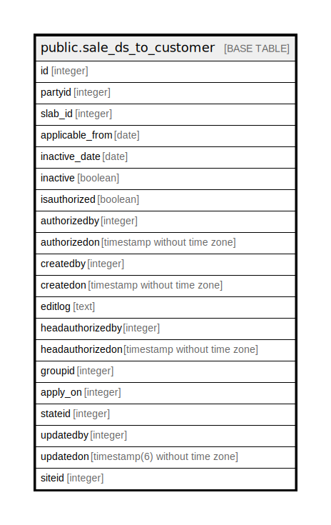

# public.sale_ds_to_customer

## Description

## Columns

| Name | Type | Default | Nullable | Children | Parents | Comment |
| ---- | ---- | ------- | -------- | -------- | ------- | ------- |
| id | integer | nextval('sale_ds_to_customer_id_seq'::regclass) | false |  |  |  |
| partyid | integer |  | true |  |  |  |
| slab_id | integer |  | true |  |  |  |
| applicable_from | date |  | true |  |  |  |
| inactive_date | date |  | true |  |  |  |
| inactive | boolean |  | true |  |  |  |
| isauthorized | boolean | false | true |  |  |  |
| authorizedby | integer |  | true |  |  |  |
| authorizedon | timestamp without time zone |  | true |  |  |  |
| createdby | integer |  | true |  |  |  |
| createdon | timestamp without time zone | now() | true |  |  |  |
| editlog | text |  | true |  |  |  |
| headauthorizedby | integer |  | true |  |  |  |
| headauthorizedon | timestamp without time zone |  | true |  |  |  |
| groupid | integer |  | true |  |  |  |
| apply_on | integer |  | true |  |  | 1=Group 2=Category |
| stateid | integer |  | true |  |  |  |
| updatedby | integer |  | true |  |  |  |
| updatedon | timestamp(6) without time zone | NULL::timestamp without time zone | true |  |  |  |
| siteid | integer | 0 | true |  |  |  |

## Constraints

| Name | Type | Definition |
| ---- | ---- | ---------- |
| sale_ds_to_customer_pkey | PRIMARY KEY | PRIMARY KEY (id) |

## Indexes

| Name | Definition |
| ---- | ---------- |
| sale_ds_to_customer_pkey | CREATE UNIQUE INDEX sale_ds_to_customer_pkey ON public.sale_ds_to_customer USING btree (id) |

## Relations

---

> Generated by [tbls](https://github.com/k1LoW/tbls)
