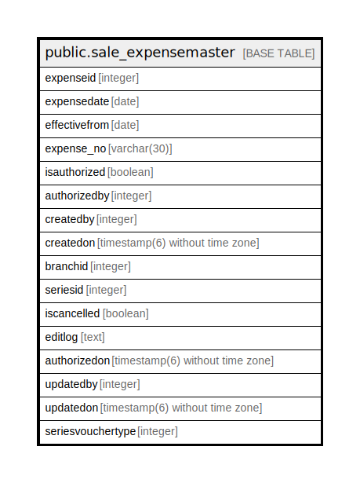

# public.sale_expensemaster

## Description

## Columns

| Name | Type | Default | Nullable | Children | Parents | Comment |
| ---- | ---- | ------- | -------- | -------- | ------- | ------- |
| expenseid | integer | nextval('sale_expensemaster_expenseid_seq'::regclass) | false |  |  |  |
| expensedate | date |  | false |  |  |  |
| effectivefrom | date |  | false |  |  |  |
| expense_no | varchar(30) |  | false |  |  |  |
| isauthorized | boolean | false | true |  |  |  |
| authorizedby | integer |  | true |  |  |  |
| createdby | integer |  | true |  |  |  |
| createdon | timestamp(6) without time zone | now() | true |  |  |  |
| branchid | integer |  | true |  |  |  |
| seriesid | integer |  | true |  |  |  |
| iscancelled | boolean | false | true |  |  |  |
| editlog | text |  | true |  |  |  |
| authorizedon | timestamp(6) without time zone |  | true |  |  |  |
| updatedby | integer |  | true |  |  |  |
| updatedon | timestamp(6) without time zone | NULL::timestamp without time zone | true |  |  |  |
| seriesvouchertype | integer |  | true |  |  |  |

## Constraints

| Name | Type | Definition |
| ---- | ---- | ---------- |
| sale_expensemaster_pkey | PRIMARY KEY | PRIMARY KEY (expenseid) |

## Indexes

| Name | Definition |
| ---- | ---------- |
| sale_expensemaster_pkey | CREATE UNIQUE INDEX sale_expensemaster_pkey ON public.sale_expensemaster USING btree (expenseid) |

## Relations

---

> Generated by [tbls](https://github.com/k1LoW/tbls)
