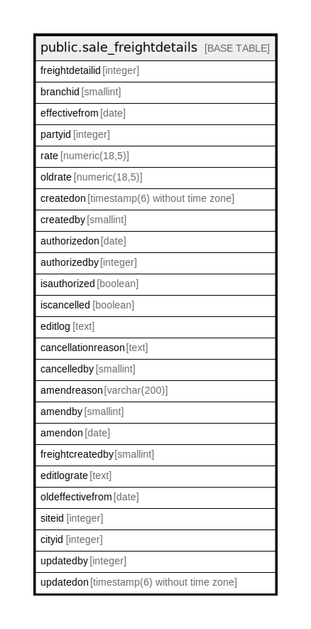

# public.sale_freightdetails

## Description

## Columns

| Name | Type | Default | Nullable | Children | Parents | Comment |
| ---- | ---- | ------- | -------- | -------- | ------- | ------- |
| freightdetailid | integer | nextval('sale_freightdetails_freightdetailid_seq'::regclass) | false |  |  |  |
| branchid | smallint |  | true |  |  |  |
| effectivefrom | date |  | true |  |  |  |
| partyid | integer |  | true |  |  |  |
| rate | numeric(18,5) | 0 | true |  |  |  |
| oldrate | numeric(18,5) | 0 | true |  |  |  |
| createdon | timestamp(6) without time zone | now() | true |  |  |  |
| createdby | smallint |  | true |  |  |  |
| authorizedon | date |  | true |  |  |  |
| authorizedby | integer |  | true |  |  |  |
| isauthorized | boolean |  | true |  |  |  |
| iscancelled | boolean | false | true |  |  |  |
| editlog | text |  | true |  |  |  |
| cancellationreason | text |  | true |  |  |  |
| cancelledby | smallint |  | true |  |  |  |
| amendreason | varchar(200) |  | true |  |  |  |
| amendby | smallint |  | true |  |  |  |
| amendon | date |  | true |  |  |  |
| freightcreatedby | smallint |  | true |  |  |  |
| editlograte | text |  | true |  |  |  |
| oldeffectivefrom | date |  | true |  |  |  |
| siteid | integer |  | true |  |  |  |
| cityid | integer |  | true |  |  |  |
| updatedby | integer |  | true |  |  |  |
| updatedon | timestamp(6) without time zone | NULL::timestamp without time zone | true |  |  |  |

## Constraints

| Name | Type | Definition |
| ---- | ---- | ---------- |
| brandpartydate | UNIQUE | UNIQUE (branchid, effectivefrom, partyid) |
| sales_freightdetails_pkey | PRIMARY KEY | PRIMARY KEY (freightdetailid) |

## Indexes

| Name | Definition |
| ---- | ---------- |
| brandpartydate | CREATE UNIQUE INDEX brandpartydate ON public.sale_freightdetails USING btree (branchid, effectivefrom, partyid) |
| sales_freightdetails_pkey | CREATE UNIQUE INDEX sales_freightdetails_pkey ON public.sale_freightdetails USING btree (freightdetailid) |

## Relations

---

> Generated by [tbls](https://github.com/k1LoW/tbls)
